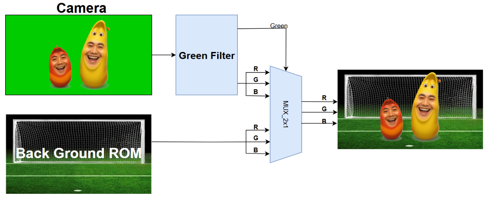

# Chroma Key



## 1. 모듈 개요

**Chromakey_Filter**는 FPGA 상에서 **크로마키 처리(녹색 배경 합성)**를 수행하는 최상위 모듈이다.

이 모듈은 카메라에서 입력된 영상의 RGB 데이터를 분석하여, 픽셀이 **그린 스크린(녹색 영역)**인지 판별하고, 녹색일 경우에는 **배경 이미지(ROM에서 읽어온 픽셀)**로 대체하여 최종 출력한다.

즉, 카메라 영상 + 배경 이미지를 실시간으로 합성하는 **크로마키 필터** 역할을 한다.

---

## 2. 내부 블록 구성

크로마키 모듈은 크게 네 개의 하위 블록으로 구성된다.

1. **GreenFilter_RGB**
    - 입력된 RGB 값이 “녹색 영역”인지 판별하는 블록
    - G 성분의 크기, R/B 대비 우세 정도, R/B의 최대 허용값을 기준으로 **green** 신호 생성
    - **green=1** → 녹색 판정, **green=0** → 카메라 영상
2. **BackgroundROM**
    - 배경 이미지를 저장한 ROM
    - 해상도: 320×240 (QVGA)
    - 픽셀 포맷: RGB565 (16비트)
    - $readmemh("background.mem")를 통해 초기화
    - 주소 입력(raddr)에 따라 해당 픽셀 값을 출력(data)
3. **ImgReader**
    - 화면 좌표 (x,y)를 **배경 ROM 주소**로 변환
    - VGA 입력 해상도: 640×480
    - 배경 해상도: 320×240 → 좌표를 1/2 스케일링(>>1)하여 매핑
    - ROM에서 읽은 RGB565 데이터를 RGB444(12bit)로 변환하여 출력 포트(r_port, g_port, b_port)에 전달
4. **Chromakey_Filter (Top)**
    - 위 블록들을 상위에서 연결
    - 카메라 입력 RGB와 배경 이미지 출력 RGB를 관리
    - 최종적으로, 녹색 여부(green)에 따라 **카메라 영상** 또는 **배경 영상**을 출력하도록 선택

---

## 3. 동작 원리

1. 카메라로부터 RGB(5:6:5) 데이터가 입력된다.
2. GreenFilter_RGB에서 해당 픽셀이 녹색인지 판별한다.
    - G 값이 임계값 이상인지
    - G 값이 R, B보다 충분히 큰지
    - R과 B 값이 허용 범위보다 작은지
3. ImgReader가 현재 (x,y) 좌표를 기반으로 배경 ROM 주소를 계산하여 BackgroundROM에서 배경 픽셀을 읽어온다.
4. Chromakey_Filter는 녹색 여부(green)에 따라 다음을 선택한다:
    - **green=1** → 배경 픽셀 출력
    - **green=0** → 카메라 원본 픽셀 출력
5. 최종적으로, VGA 출력 포트(r_port, g_port, b_port)에 합성된 영상이 전달된다.

---

## 4. 핵심 특징

- **실시간 동작**: DE(Data Enable) 신호와 좌표(x,y)를 이용하여 픽셀 단위로 합성
- **해상도 매칭**: 640×480 입력 영상과 320×240 배경 영상을 다운스케일링 매핑
- **유연한 임계값 조정**: 파라미터(G_THRESH, R_MAX, B_MAX)를 통해 녹색 검출 민감도 조정 가능
- **간단한 구조**: LUT 기반 ROM과 단순 비교 연산만 사용하여 FPGA에 적합

---

## 5. CODE

<details>
    <summary>Chromakey_Code</summary>

```verilog
`timescale 1ns / 1ps
module Chromakey_Filter (
    input  logic       DE,
    input  logic [9:0] x,
    input  logic [9:0] y,
    input  logic [4:0] i_r,
    input  logic [5:0] i_g,
    input  logic [4:0] i_b,
    output logic       green,
    output logic [3:0] r_port,
    output logic [3:0] g_port,
    output logic [3:0] b_port
);
    logic [16:0] bg_addr;
    logic [15:0] bg_data;
    ImgReader U_Chromakey_Reader (
        .DE    (DE),
        .x     (x),
        .y     (y),
        .addr  (bg_addr),
        .data  (bg_data),
        .r_port(r_port),
        .g_port(g_port),
        .b_port(b_port)
    );
    BackgroundROM U_BACKROM (
        .raddr(bg_addr),
        .data (bg_data)
    );
    GreenFilter_RGB U_ChromakeyFilter_RGB(
        .i_r(i_r),
        .i_g(i_g),
        .i_b(i_b),
        .green(green)
    );
endmodule

module BackgroundROM (
    input  logic [16:0] raddr,
    output logic [15:0] data
);
    logic [15:0] mem[0:320*240-1];
    initial begin
        $readmemh("background.mem", mem);
    end
    assign data = mem[raddr];
endmodule

module GreenFilter_RGB (
    input  logic [4:0] i_r,
    input  logic [5:0] i_g,
    input  logic [4:0] i_b,
    output logic       green
);
    parameter G_THRESH           = 6'd18; 
    parameter DOMINANCE_OFFSET_R = 6'd7;  
    parameter DOMINANCE_OFFSET_B = 6'd7;  
    parameter R_MAX              = 5'd28; 
    parameter B_MAX              = 5'd28;

    logic [5:0] r_6bit, b_6bit;

    assign r_6bit = {i_r, i_r[4]};
    assign b_6bit = {i_b, i_b[4]};
    assign green = (i_g >= G_THRESH) &&
                   (i_g > r_6bit + DOMINANCE_OFFSET_R) &&
                   (i_g > b_6bit + DOMINANCE_OFFSET_B) &&
                   (i_r < R_MAX) &&
                   (i_b < B_MAX);
endmodule

module ImgReader (
    input  logic        DE,
    input  logic [ 9:0] x,
    input  logic [ 9:0] y,
    output logic [16:0] addr,
    input  logic [15:0] data,
    output logic [ 3:0] r_port,
    output logic [ 3:0] g_port,
    output logic [ 3:0] b_port
);
    logic img_show;
    assign img_show = (DE && (x < 640) && (y < 480));
    assign addr = img_show ? ((y >> 1) * 320 + (x >> 1)) : 17'bz;
    assign {r_port, g_port, b_port} = img_show ? {data[15:12], data[10:7], data[4:1]} : 12'b0;
endmodule
```

</details>
