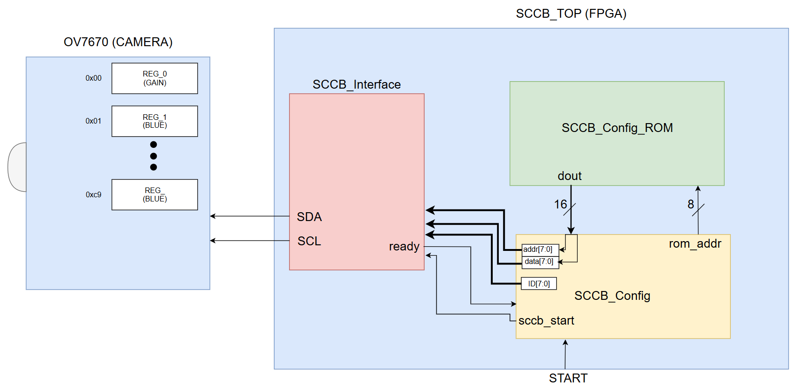
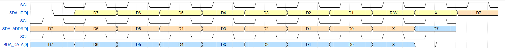
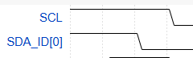
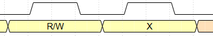
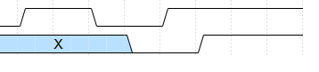

# 📌 SCCB 전체 구조

---

## 🏗️ 주요 블록 구성

- **SCCB_Config_ROM**  
  → Write할 **레지스터 주소**와 **데이터**를 저장 및 불러오기  

- **SCCB_Config**  
  → 타이밍 및 전송할 데이터 제어  

- **SCCB_Interface**  
  → 타이밍에 맞게 **SCL, SDA 송신**

---

# 📡 SCCB Protocol

---

## ⚙️ 상태 및 동작

- **IDLE 상태**  
 
  - `SCL = 1`, `SDA = 1`  
  - `SCL = 1`일 때 **SDA 하강엣지** 순간 → **START** 발생  

- **전송 순서**  
  1. **ID (Slave Address)** 
    
     - 슬레이브 모듈을 구분하는 7비트  
     - 8번째 비트: **R/W 여부**
       - `0 = Write`  
       - `1 = Read`  
       - 마지막 비트는 **Don’t Care** (`0`/`1` 무관)
  2. **REG_ADDR (Register Address)**  
     - 슬레이브 모듈 내부 레지스터 주소 전송 
     - 마지막 비트는 **Don’t Care** (`0`/`1` 무관) 
  3. **REG_DATA (Register Data)**  
     - 레지스터에 Write할 데이터 전송  
     - 마지막 비트는 **Don’t Care** (`0`/`1` 무관)

- **DONE (Stop Condition)**  
    
  - 전송 종료 시, `SCL = 1`일 때 **SDA 상승엣지** 순간 DONE 발생  
  - IDLE상태로 회귀

---
