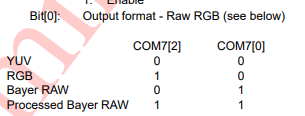
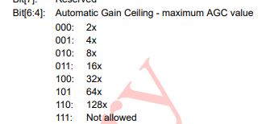

# OV7670 레지스터 정리

---

## 주요 개념

* **Register 개념**: 카메라에서 받는 영상의 설정값들을 조정하기 위한 Control/Data Regiseter가 존재합니다.
* **REG_COMx**: 컨트롤 레지스터
* **AWB (Auto White Balance)**: 백열등이 노란색 계열 빛을 띄는 것과 같이 우리 눈이 보는 것과 다른 색을, 눈에서 보는 것과 같이 보정하기 위해 존재합니다.
* **AGC (Auto Gain Control)**: 자동 빛(GAIN) 조절 제어
* **AEC (Auto Exposure Control)**: 자동 노출 제어
* **컬러 필터 배열**: `GRGRGR...`, `BGBGBG...` 패턴이 반복되며, G(녹색)가 두 배 많습니다.
* **YUV**:
    * Y: 밝기(휘도)
    * U: 파란색과 밝기 사이의 색상 차이
    * V: 빨간색과 밝기 사이의 색상 차이
    * **공식**:
        * $Y = 0.3R + 0.6G + 0.1B$
        * $U = (B-Y) \times 0.5$
        * $V = (R-Y) \times 0.9$
* **Output Drive Capability**: 출력 전력을 조절하여 센서의 신호를 강하게 합니다. 긴 케이블, 고주파, 여러 장치 연결 시 높은 값으로 설정합니다. (신호 강도, 노이즈 내성 증가)
* **OPB (Optical Black)**: 빛이 닿지 않도록 가린 여분의 픽셀로, 유효 이미지 측정에 사용됩니다.
* **Pre-scale**: 클럭 사전 분주
* **RAW RGB**: 픽셀별로 RGB가 있는 것이 아닌, 상대적인 노출값으로 데이터를 저장합니다.
* **DCW (Digital Clock WaveForm)**: 디지털 클록 제어
* **DSP (Digital Signal Processor)**: 디지털 신호 프로세서
* **컬러 매트릭스**: 카메라 센서가 캡처한 원시 색상(예: RGB)을 정확한 색상(표준 색상 공간)으로 변환하는 데 사용되는 수학적 계산(행렬)입니다.
* **Contrast (명암)**: 가장 밝은 부분과 가장 어두운 부분 사이의 밝기 차이입니다.
* **밴딩 현상**: 센서의 캡처 속도(프레임 속도)와 조명의 깜빡임 주파수가 맞지 않아, 이미지에 어둡고 밝은 줄무늬가 번갈아 나타나는 현상입니다.
* **히스토그램**: 이미지의 밝기 값(0~255)이 각각 얼마나 많이 분포하는지를 그래프로 나타낸 것입니다.

---

## 레지스터별 정리

* **`REG_GAIN`**: AGC(빛 조절 증폭)는 `COM8` 값에 따라 자동/수동 모드가 결정됩니다. 수동 모드에서 `GAIN` 값(빛 신호 증폭)을 이 레지스터에서 읽어옵니다.

* **`REG_BLUE`**: AWB(RGB 조절 보정)는 `COM8` 값에 따라 자동/수동 모드가 결정됩니다. 수동 모드에서 Blue `GAIN` 값을 이 레지스터에서 읽어옵니다.

* **`REG_RED`**: AWB(RGB 조절 보정)는 `COM8` 값에 따라 자동/수동 모드가 결정됩니다. 수동 모드에서 Red `GAIN` 값을 이 레지스터에서 읽어옵니다.

* **`REG_VREF`**: `REG_GAIN`, `REG_VSTART`, `REG_VSTOP`의 데이터 비트를 확장합니다.
    * `[7:6]`: GAIN 상위 2비트
    * `[3:2]`: `VSTOP[1:0]`
    * `[1:0]`: `VSTART[1:0]`

* **`REG_COM1`**: CCIR656 포맷, AEC 데이터 비트 확장.
    * `[6]`: CCIR656 format enable
    * `[1:0]`: `AEC[1:0]`

* **`REG_BAVE`**: U/B (블루 색상) 평균값 자동 저장.

* **`REG_GbAVE`**: Y/Gb (휘도, 블루 옆 그린 픽셀) 평균값 자동 저장.

* **`REG_AECHH`**: AEC 비트 확장.
    * `[5:0]`: `AEC[15:10]`

* **`REG_RAVE`**: V/R (레드 색상) 평균값 자동 저장.

* **`REG_COM2`**: 저전력 모드, 출력 전력 조절.
    * `[4]`: Soft sleep mode
    * `[1:0]`: Output Drive Capability (`00`: 1x, `01`: 2x, `10`: 3x, `11`: 4x)

* **`REG_PID`**, **`REG_VER`**: 제품 ID 번호 (Read only).

* **`REG_COM3`**: 출력 데이터 형식과 디지털 기능.
    * `[3]`: Scale enable (확대/축소 기능 활성화)
    * `[2]`: DCW enable (디지털 클록 제어)

* **`REG_COM4`**:
    * `[5:4]`: 자동 노출/게인 제어 영역 설정 (`00`: full, `01`: 1/2, `10`: 1/4)

* **`REG_COM5`**: Reserved.

* **`REG_COM6`**:
    * `[7]`: OPB 라인 출력 여부.

* **`REG_AECH`**: AEC 비트 확장.
    * `[7:0]`: `AEC[9:2]`

* **`REG_CLKRC`**: 클럭 제어.
    * `[6]`: 외부 입력 클럭(XCLK) pre-scale 비활성화.
    * `[5:0]`: XCLK pre-Scale 설정. `내부클럭 = 입력클럭 / ([5:0]값 + 1)`

* **`REG_COM7`**: 출력 포맷 설정 및 리셋.
    * `[7]`: 모든 레지스터 리셋.
    * `[5]`: CIF 포맷 선택.
    * `[4]`: QVGA 포맷 선택.
    * `[3]`: QCIF 포맷 선택.
    * `[2]`: RGB 포맷 선택.
    * `[1]`: Colorbar 출력.
    * `[0]`: Raw RGB 포맷 선택.

* **`REG_COM8`**:
    * `[7]`: Fast AGC/AEC 알고리즘 enable.
    * `[6]`: AEC 범위 설정.
    * `[5]`: Banding filter enable.
    * `[2]`: AGC enable.
    * `[1]`: AWB enable.
    * `[0]`: AEC enable.

* **`REG_COM9`**:
    * `[6:4]`: AGC 최대 게인값 조절.
    * `[0]`: AGC/AEC 멈춤.

* **`REG_COM10`**:
    * `[6]`: HREF에서 HSYNC로 변환.
    * `[5]`: 수평 공백 동안 PCLK 토글 중지.
    * `[4]`: PCLK 신호 반전.
    * `[1]`: VSYNC 신호 반전.
    * `[0]`: HSYNC 신호 반전.

* **`REG_HSTART`**: 수평 프레임 시작점. (`[7:0]`은 `[10:3]` 값 + `REG_HREF[2:0]`)
* **`REG_HSTOP`**: 수평 프레임 종료점. (`[7:0]`은 `[10:3]` 값 + `REG_HREF[5:3]`)
* **`REG_VSTART`**: 수직 프레임 시작점. (`[7:0]`은 `[9:2]` 값 + `REG_VREF[1:0]`)
* **`REG_VSTOP`**: 수직 프레임 종료점. (`[7:0]`은 `[9:2]` 값 + `REG_VREF[3:2]`)

* **`REG_PSHFT`**: 픽셀 데이터 출력 지연.

* **`REG_MIDH`**, **`REG_MIDL`**: ID (신경 쓸 필요 없음).

* **`REG_MVFP`**:
    * `[5]`: 이미지 수평 반전.
    * `[4]`: 이미지 수직 반전.
    * `[2]`: Black sun 기능 활성화.

* **`REG_AEW`**, **`REG_AEB`**: AGC/AEC 상한/하한값 조정.

* **`REG_VPT`**: FAST 모드 AGC/AEC 상/하한 영역 조정.

* **`REG_HREF`**: HREF 제어.
    * `[5:3]`: `HSTOP` 하위 3비트 확장.
    * `[2:0]`: `HSTART` 하위 3비트 확장.

* **`REG_TSLB`**: 라인 버퍼 테스트 옵션.
    * `[5]`: 이미지 색상 반전.
    * `[4]`: UV 값 소스 선택 (`0`: 센서 계산, `1`: `MANU`/`MANV` 레지스터).
    * `[3]` & `COM13[0]`: 출력 순서 제어 (`00`: YUYV, `01`: YVYU, `10`: UYVY, `11`: VYUY).

* **`REG_COM11`**:
    * `[7]`: 야간 모드 활성화 (프레임 속도 자동 감소).
    * `[6:5]`: 야간 모드 최소 프레임 속도 설정.
    * `[4]`: 50/60Hz 자동 감지.
    * `[3]`: 밴딩 필터 수동 선택 (`0`: 60Hz, `1`: 50Hz).

* **`REG_COM13`**:
    * `[7]`: 감마 보정 활성화.
    * `[6]`: 센서 색상 채도(UV) 자동 조절.
    * `[0]`: U, V 출력 순서 제어.

* **`REG_COM14`**:
    * `[4]`: DCW, PCLK 스케일링 활성화.
    * `[2:0]`: PCLK 분주 설정.

* **`REG_EDGE`**:
    * `[4:0]`: 엣지(경계선) 강화 계수.

* **`REG_COM15`**:
    * `[7:6]`: 출력 데이터 범위 제한 (`11`: 전체 0x00~0xFF).
    * `[5:4]`: RGB 출력 포맷 (`01`: RGB565, `11`: RGB555).

* **`REG_COM16`**:
    * `[5]`: 엣지 강화 계수 자동 조절.
    * `[4]`: 노이즈 제거 계수 자동 조절.
    * `[1]`: 컬러 매트릭스 계수 x2 (색상 채도).

* **`REG_DNSTH`**: 노이즈 제거 계수.

* **`REG_MTX1~6`**: 컬러 매트릭스 계수.

* **`REG_BRIGHT`**: 밝기 조절 계수.

* **`REG_CONTRAS`**: 대비(명암) 조절 계수.

* **`REG_CONTRAS_CENTER`**: 대비 조절 중심점.

* **`REG_MTX_SIGN`**:
    * `[7]`: `REG_CONTRAS_CENTER` 값 자동 조절 활성화.
    * `[5:0]`: 6개 MTX 매트릭스 부호 설정 (`0`: 양수, `1`: 음수).

* **`REG_MANU`**, **`REG_MANV`**: U/V 채널 수동 설정 값.

* **`REG_GFIX`**: 채널별 고정 게인 값 조절.

* **`REG_GGAIN`**: G 채널 AWB 게인 조절.

* **`REG_DBLV`**: PLL 제어, 전력 조절.
    * `[7:6]`: PLL 배율 (`01`: x4, `10`: x6, `11`: x8).

* **`REG_SCALING_XSC`**, **`REG_SCALING_YSC`**: 이미지 수평/수직 확대/축소 비율.
    * `[7]`: 테스트 패턴 출력.

* **`REG_SCALING_DCWCTR`**: DCW 컨트롤 (다운 샘플링 비율 및 옵션).

* **`REG_SCALING_PCLK_DIV`**: PCLK 분주기 설정.

* **`REG_REG74`**: AGC 비활성 시 디지털 게인 수동 제어.

* **`REG_REG75`**: 엣지 향상 하한 최소값.

* **`REG_REG76`**:
    * `[7]`: 블랙 픽셀 보정 활성화.
    * `[6]`: 화이트 픽셀 보정 활성화.
    * `[4:0]`: 엣지 향상 상한 최대값.

* **`REG_BD50ST`**, **`REG_BD60ST`**: 50Hz/60Hz 밴딩 필터 계수.

* **`REG_HAECC1~6`**: 히스토그램 기반 AEC/AGC 제어 1~6.

* **`REG_HAECC7`**:
    * `[7]`: AEC 알고리즘 선택 (`0`: 평균 기반, `1`: 히스토그램 기반).

* **`REG_BD50MAX`**, **`REG_BD60MAX`**: 50Hz/60Hz 밴딩 스텝 최대 한도.
