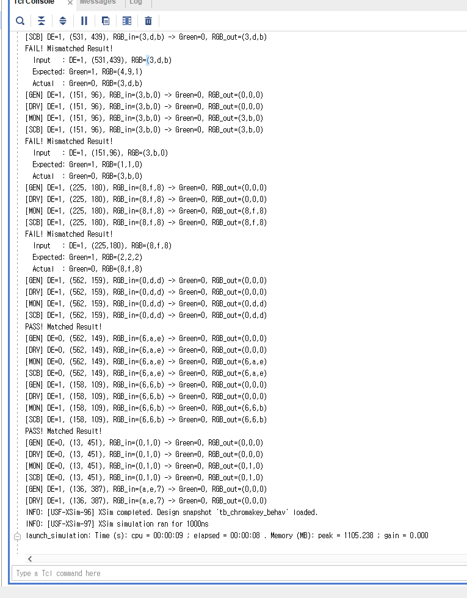

화면 밀림현상 해결법

posedge edge로 수정해서 해결함
## VGA_Decoder.sv
```verilog
`timescale 1ns / 1ps

module VGA_Decoder(
    input  logic       clk,
    output logic       pclk,
    input  logic       reset,
    output logic       h_sync,
    output logic       v_sync,
    output logic [9:0] x_pixel,
    output logic [9:0] y_pixel,
    output logic       DE
);
    logic [9:0] v_counter;
    logic [9:0] h_counter;

    Pixel_clk_gen U_P_CLK (.*);
    pixel_counter U_P_COUNTER (.*);
    vga_decoder U_VGA_Decoder (.*);
endmodule

/////////////////////////////////////////////////////////////////////

// [수정 1] 안정적인 50% Duty-Cycle 클럭 생성 (예: 100MHz -> 25MHz)
module Pixel_clk_gen (
    input  logic clk,
    input  logic reset,
    output logic pclk
);
    logic [1:0] p_counter;
    always_ff @(posedge clk, posedge reset) begin
        if (reset) begin
            p_counter <= 0;
        end else begin
            p_counter <= p_counter + 1;
        end
    end
    assign pclk = p_counter[1];  // Divide by 4
endmodule

/////////////////////////////////////////////////////////////////////

// [수정 2] 모든 로직을 'posedge' 기준으로 통일
module pixel_counter (
    input  logic       pclk,
    input  logic       reset,
    output logic [9:0] v_counter,
    output logic [9:0] h_counter
);
    localparam H_MAX = 800, V_MAX = 525;

    always_ff @(posedge pclk, posedge reset) begin  // negedge -> posedge
        if (reset) h_counter <= 0;
        else if (h_counter == H_MAX - 1) h_counter <= 0;
        else h_counter <= h_counter + 1;
    end

    always_ff @(posedge pclk, posedge reset) begin  // negedge -> posedge
        if (reset) v_counter <= 0;
        else if (h_counter == H_MAX - 1) begin
            if (v_counter == V_MAX - 1) v_counter <= 0;
            else v_counter <= v_counter + 1;
        end
    end
endmodule

/////////////////////////////////////////////////////////////////////

module vga_decoder (
    input  logic [9:0] h_counter,
    input  logic [9:0] v_counter,
    input  logic       pclk,
    input  logic       reset,
    output logic       h_sync,
    output logic       v_sync,
    output logic [9:0] x_pixel,
    output logic [9:0] y_pixel,
    output logic       DE
);
    localparam H_Visible_area = 640, H_Front_porch = 16, H_Sync_pulse = 96, H_Back_porch = 48, H_Whole_Line = 800;
    localparam V_Visible_area = 480, V_Front_porch = 10, V_Sync_pulse = 2, V_Back_porch = 33, V_Whole_frame = 525;

    // 요청하신 대로 x_pixel 값 보정 로직을 적용
    assign x_pixel = (h_counter >= 800) ? h_counter - 800 + 1 : h_counter + 1;
    // 혹시나 해서 이거 assign x_pixel = (h_counter >= H_Whole_Line) ? h_counter - 800 + 1 : h_counter + 1; 이거로 바꿔보기
    assign y_pixel = v_counter;

    always_ff @(posedge pclk, posedge reset) begin
        if (reset) begin
            h_sync <= 1'b1; 
            v_sync <= 1'b1; 
            DE     <= 1'b0;
        end else begin
            h_sync <= !((h_counter >= (H_Visible_area+H_Front_porch)) && (h_counter <= (H_Visible_area + H_Front_porch + H_Sync_pulse)));
            v_sync <= !((v_counter >= (V_Visible_area+V_Front_porch)) && (v_counter <= (V_Visible_area + V_Front_porch + V_Sync_pulse)));
            DE     <= ((h_counter < H_Visible_area) && (v_counter < V_Visible_area));
        end
    end
endmodule
```

여기도 latching 한번 함

## OV7670_MemController.sv
```verilog
`timescale 1ns / 1ps

module OV7670_MemController (
    input  logic        clk,
    input  logic        reset,
    // ov7670 side
    input  logic        href,
    input  logic        vsync,
    input  logic [7:0]  ov7670_data,
    // memory side
    output logic        we,
    output logic [16:0] wAddr,
    output logic [15:0] wData
);

    logic [15:0] pixel_data_high_byte; // 상위 바이트만 임시 저장
    logic [9:0]  h_counter;
    logic [7:0]  v_counter;

    always_ff @(posedge clk, posedge reset) begin
        if (reset) begin
            h_counter <= 0;
            we        <= 1'b0;
            // [추가] 출력 레지스터 리셋
            wAddr     <= 0;
            wData     <= 0;
        end else begin
            if (href) begin
                h_counter <= h_counter + 1;
                if (h_counter[0] == 0) begin // 픽셀의 첫 번째 바이트(상위) 수신
                    pixel_data_high_byte[15:8] <= ov7670_data;
                    we <= 1'b0;
                end else begin // 픽셀의 두 번째 바이트(하위) 수신
                    // [수정] 두 번째 바이트를 받는 시점에 주소, 데이터, 쓰기 신호를 함께 래칭
                    wAddr <= v_counter * 320 + h_counter[9:1];
                    wData <= {pixel_data_high_byte[15:8], ov7670_data};
                    we    <= 1'b1;
                end
            end else begin
                h_counter <= 0;
                we        <= 1'b0;
            end
        end
    end

    always_ff @(posedge clk, posedge reset) begin
        if (reset) begin
            v_counter <= 0;
        end else begin
            // VSync 신호는 일반적으로 프레임의 시작을 알리는 펄스이므로,
            // href가 끝나는 시점과 VSync의 엣지를 함께 고려하는 것이 안정적입니다.
            // 여기서는 기존 로직을 유지합니다.
            if (vsync) begin 
                v_counter <= 0;
            end else if (h_counter == (320 * 2 - 1)) begin
                v_counter <= v_counter + 1;
            end
        end
    end

endmodule
```


---

# UVM -> Chromakey


이거 지금 우리 Grenn Filter의 MAX MIN 값 설정 안되어서 FAIL나오는듯 설정하면 ㄱㅊ아짐

# UVM -> Flesh Color Filter


