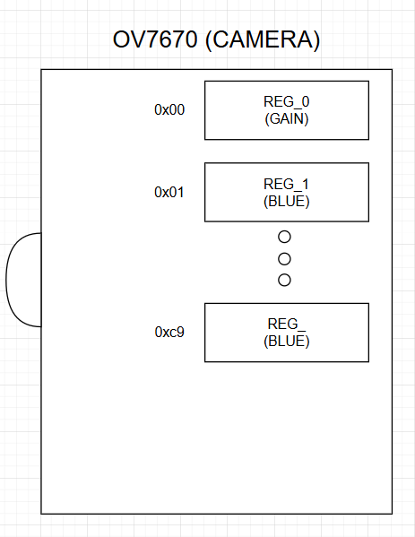
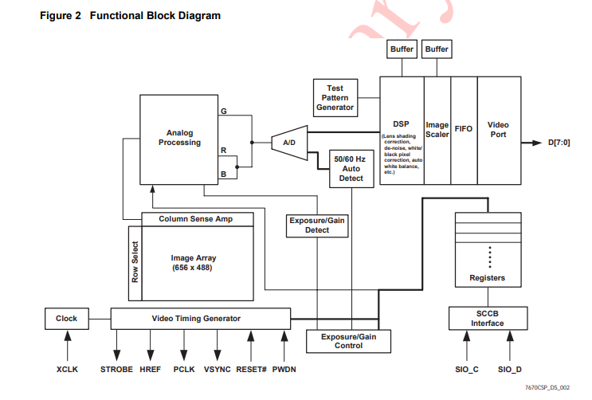

# OV7670 레지스터 정리

- **Regiseter 개념** : 카메라에서 받는 영상의 설정값들의 조정하기 위하 Control/Data Regiseter 존재

REG_COMx : 컨트롤 레지스터 
AWB : 백열등이 노란색 계열 빛을 띄는것 과 같이 우리 눈이 보는것과 다른색을 눈에서 보는것과 같이 보정하기위해 존재
AGC : 자동 빛(GAIN) 조절 제어
AEC : 자동 노출 제어
카메라 센서가 그린을 기준으로 사용하기 때문에 레드와 블루의 조절로 그린값에 맞춰주기에 
그린 레지스터는 존재X
필터 배열 : GRGRGR.. , BGBGBG… , 반복 → G는 두배 많음
YUV : Y(밝기(휘도), U(파란색과 밝기 사이의 색상 차이), V(빨간색과 밝기 사이의 색상 차이 )→
**(Y = 0.3R + 0.6G + 0.1B, U = (B-Y) x 0.5, V = (R-Y) x 0.9 )**
Output Drive Capability : 출력 전력 조절로 센서의 신호를 강하게 하여 긴케이블, 고주파, 여러장치 연결 할떄 높은 값 (신호 강도 ,노이즈 내성 증가, 발열 문)
Output of **optical black** line option : **OPB**(빛이 닿지 않도록 가린 여분의 pixel) → 유효 이미지 측정에 사
pre-scale : 클럭 사전 분주
RAW RGB : 픽셀별로 RGB가 있는것이 아닌 상대적안 노출값으로 데이터 저장
수평 공백 : HSYNC + back porch + front porch
DCW : 디지털 클록 제어
DSP(디지털 신호 프로세서)
컬러 매트릭스는 카메라 센서가 캡처한 원시 색상(예: RGB)을 정확한 색상(표준 색상 공간)으로 변환하는 데 사용되는 수학적 계산(행렬)입니다.
Contrast control : 명암조절(가장 밝은 부분과 가장 어두운 부분 사이의 밝기 차이)
밴딩 현상은 센서의 캡처 속도(프레임 속도)와 조명의 깜빡임 주파수가 맞지 않아, 이미지에 어둡고 밝은 줄무늬가 번갈아 나타나는 현상
**히스토그램**: 이미지의 밝기 값(0~255)이 각각 얼마나 많이 분포하는지를 그래프로 나타낸 것
- **레지스터 별 정리 : 
REG_GAIN : AGC(**빛 조절 증폭)는 COM8값에 따라 자동/수동 모드 결정, 
                     수동모드 에서 **GAIN**값( 빛 신호 증폭 (노이즈 증가) )을 **REG_GAIN** 에서 읽어옴
- **REG_BLUE** : **AWB**(RGB 조절 보정)는 COM8값에 따라 자동/수동 모드 결정, 
                     수동모드 에서 **GAIN**값(BLUE 신호 증폭(노이즈 증가) )을 **REG_BLUE** 에서 읽어옴
- **REG_RED** : **AWB**(RGB 조절 보정)는 COM8값에 따라 자동/수동 모드 결정, 
                     수동모드 에서 **GAIN**값(RED신호 증폭(노이즈 증가) )을 **REG_RED** 에서 읽어옴
- **REG_VREF : REG_GAIN**, **REG_VSTART**(데이터 읽기 시작 위치),
**REG_VSTOP**(데이터 읽기 멈추기 위치), 데이터 비트 확장
(실제 데이터 비트는8이지만 **REG_VREF**비트를 이용해 2비트씩 확장하여 10 비트 사용)
**( [7:6]→ GAIN 상위 2비트, [1:0]→VSTART[1:0], [3:2]→VSTOP[1:0] )**
- **REG_COM1 :** CCIR656 포맷(**데이터에 sync포함 여부), AEC(노출 시간 제어)** 데이터 비트 확장
**([6]→CCIR656 format(1이en), [1:0] → AEC[1:0])**
- **REG_BAVE : U/B** (블루 색상) 평균값 자동 저장
- **REG_GbAVE :** **Y/Gb**(휘도(밝기, 블루옆의 그린 픽셀(그린 색상) )) 평균값 자동 저장
- **REG_AECHH** :  AEC 비트 확장 **( [5:0] → AEC[15:10] )**
- **REG_RAVE** :  V/R(레드 색상) 평균값 자동 저장
- **REG_COM2** : Soft sleep mode(저전력), Output Drive Capability(출력 전력 조절)
**([4]→Soft sleep mode, [1:0]→Output Drive Capability (00 : 1x, 01 : 2x, 10 : 3x, 11 : 4x) )**
- **REG_PID** : 제품 ID 번호(OV7670) read only 데이터로 신경쓸 필요x
- **REG_VER** : 제품 ID 번호(OV7670) read only 데이터로 신경쓸 필요x
- **REG_COM3** : **출력 데이터 형식**과 **디지털 기능**
**( [6]→출력 MSB,LSB 교환 여부, [5]→ 전원다운 상태에서 PCLK을 Z 출력 여부, [4]→ 전원다운 상태에서 출력 데이터을 Z 출력 여부, [3]→Scale en(확대/축소 기능 활성화), 
[2]→ DCW en(디지털 클록 제어(이미지 스케일링위해 사용) )**
- **REG_COM4** : **( [5:4]→자동 노출/게인 제어 영역 설정 (00 : full window, 01 : 1/2, 10 : 1/4, 11 : 1/4) )**
- **REG_COM5** : 모든비트 **reserved**
- **REG_COM6** : **( [7]→ OPB 까지 출력 할지 여부, [1]→ 이미지 포멧이 바뀔때 모든 타이밍 초기화 여부 )**
- **REG_AECH** : AEC 비트 확장 **( [7:0] → AEC[9:2] )**
- **REG_CLKRC** : **( [6]→외부 입력 클럭(XCLK)을 내부 클럭 바로 사용여부(pre-scale 비활성화),
[5:0]→외부 입력 클럭(XCLK) pre-Scale 여부( 내부클럭 = 입력 클럭 / ( [5:0]값 + 1 ) )  )**
- **REG_COM7** : **( [7]→모든 레지스터 리셋, [5]→출력 포멧 CIF 선택, [4]→출력 포멧 QVGA선택, [3]→출력 포멧 QCIF선택, [2]→ 출력 포멧  RGB선택, [1]→Colorbar 출력, [0]→ 출력 포멧   Raw RGB 선택 )**

- **REG_COM8** : **( [7]→fast AGC/AEC 알고리즘 en, [6]→AEC 범위(1은 모든 범), [5]→banding filter en(블링크 현상 제어), [2]→AGC en, [1]→AWB en, [0]→AEC en )**
- **REG_COM9 : ( [6:4]→ AGC최대 게인값 조절, [0]→ AGC/AEC 멈춤)**

- **REG_COM10** : **( [6]→HREF 에서 HSYNC변환, [5]→0 : PCLK 항상 토글, 1 : 수평공백 동안 PCLK 토글 x,
[4]→ PCLK 신호 반전 (상승에서 하강엣지로 변환), [3]→ HRRF신호 반전, [2]→0 : VSYNC를 하강엣지 PCLK에 맞춤, 1 : VSYNC를 상승 엣지PCLK에 맞춤, [1]→VSYNC 반전, [0]→HSYNC 반전 )**
- **REG_HSTART** :  수평 프레임 시작점( 이미지 수평 방향 이동, 이미지 cut) 11비트
 **( [7:0]→ [10:3] + REG_HREF[2:0] )**
- **REG_HSTOP** : 수평 프레임 종료점( 이미지 수평 방향 이동, 이미지 cut) 11비트
**( [7:0]→ [10:3] +REG_HREF[5:3]  )**
- **REG_VSTART** :  수직 프레임 시작점 (이미지 수직 방향 이동, 이미지 cut) 10비트
**( [7:0]→ [9:2] +REG_VREF[1:0]  )**
- **REG_VSTOP** :  수직 프레임 종료점(이미지 수직 방향 이동, 이미지 cut) 10비트
**( [7:0]→ [9:2] +REG_VREF[3:2]  )**
- **REG_PSHFT** : 픽셀 데이터 출력 지연 (0~256픽셀까지 지연 가능)
- **REG_MIDH :** 아이디 신경x
- **REG_MIDL :** 아이디 신경x
- **REG_MVFP** :  **( [5]→이미지 수평 반전, [4]→ 이미지 수직 반전, [2]→black sun 기능 활성화 )**
- **REG_AEW** : AGC/AEC 상한값 조정 (자동으로 값조절시 최대값조정)
- **REG_AEB** :  AGC/AEC 하한값 조정 (자동으로 값조절시 최소값조정)
- **REG_VPT** : FAST모드 AGC/AEC 상/하한 영역 조정
**( [7:4]→ 상하 영역 조정값, [3:0]→하한 영역 조정값 )**
- **REG_HSYST** : HSYNC 상승 엣지 지연
- **REG_HSYEN** : HSYNC 하강 엣지 지연
- **REG_HREF** : HREF 제어
**( [7:6]→HREF 엣지 오프셋을 데이터 출력에 맞게 clk단위 조절(지연,당김), 
[5:3]→HSTOP하위 3비트 확장, [2:0]→START하위 3비트 확장  )**
- **REG_TSLB** : 라인 버퍼 테스트 옵션
**( [5]→이미지 색상 반전, [4]→0 : nomal UV(센서 계산), 1 : 고정 UV(레지스터  MANU, MANV), 
[3],COM13[0]→출력순서 제어, 00 : YUYV, 01 : YVYU, 10 : UYVY, 11 : VYUY, [0]→자동 윈도우 출력,
0 : 해상도 변경후 뒷단 프로세서(FPGA)가 수동으로 맞춰줘야함, 1 : 센서에서 자동 출력 윈도우 맞춤(다음 VSYNC 이후) )**
- **REG_COM11 : ( [7]→야간모드(활성화 시 프레임 속도 자동 줄어듬), [6:5]→야간 모드 최소 프레임 속도(00 : 일반 모드와 동일, 01 : 일반모드 절반, 10 : 일반모드/4, 11 : 일반모드/8 ), [4]→50/60Hz 자동감지,
[3]→ 0 : BD60ST값을 밴딩 필터로 선택, 1 : BD50ST 밴딩 필터로 선택, [1]→ 빛이 너무 강할떄 밴딩 필터 제한 이하로 노출 시간 줄임 )**
- **REG_COM12** : **( [7]→0 : HREF 가 VSYNC가 로우일떄 나오지 않음, 1 : HREF가 항상 나옴 )**
- **REG_COM13** : **( [7]→감마 보정 활성화, [6]→ 센서 색상 채도(UV) 자동 조절(결과값 SATCTR에 저장),
[0]→U, V 출련순서 제어(TSLB 랑 같이함)  )**
- **REG_COM14 : ( [4]→ 0 : nomal PCLK, 1 : DCW, PCLK 스케일링(COM14[2:0], SCALING_PCLK_DIV[3:0]), [3]→ 미리 정의된 해상도 모드 스케일링 매개견부 수동 조절, 
[2:0]→PCLK 분주, 000:1분주, 001:2분주, 010:4분주, 011:8분주, 100:16분주, 나머진 사용x  )**
- **REG_EDGE** : **( [4:0]→엣지(경계선) 강화(선명도) 계수, 이미지 흐릴떄 선명도 높임  )**
- **REG_COM15** : **( [7:6]→ 출력 데이터(8비트)범위 제한(0x00~0xff), 0x : 출력(0x10 ~ 0xf0)사용,
10 : 출력(0x01 ~ 0xfe)사용,  11 : 8비트 전체 사용, [5:4]→x0 : nomal RGB, 01 : RGB565출력, 11 : RGB555출력 )**
- **REG_COM16** : **( [5]→ 엣지 강화 계수 자동 조절(결과값 EDGE 레지스터 저장), [4]→노이즈 제거 계수 자동 조절(결과값 DNSTH 레지스터 저장), [3]→ AWB기능 활성화, [1]→ 컬러 매트릭스 계수 x2(색상채도) )**
- **REG_COM17 : ( [7:6]→AEC 제어 영역 창크기 (COM4와 같음), [3]→DSP 컬러바 en(컬러 바 테스트) )**
- **REG_DNSTH** : **노이즈 제거** 계수 (너무 커지면 이미지 디테일 손상 위험)
- **REG_MTX1~6** : **컬러 매트릭수** 계수
- **REG_BRIGHT** : 밝기 조절 계수 (이값 조정으로 전체 밝기올릴수 있음)
- **REG_CONTRAS** : **대비(명암)**조절 계수, 어두운 부분 더 어둡게 밝은 부분 더 밝게
- **REG_CONTRAS_CENTER** : **대비(명암)** 조절 중심점, 중심점에 비해 높은 픽셀은 더 밝아짐, 낮은 픽셀은 더 어두어짐
- **REG_MTX_SIGN** : 컬러 매트릭스 계수의 부호 선택, 자동 대비 중심점 활성화
**( [7]→REG_CONTRAS_CENTER 값 자동 조절 활성화(0은 수동), 
[5:0]→6개의 MTX 매트릭스 부호 설정(0은 양수, 1은 음수)  )**
- **REG_MANU** : U채널(파란색) 수동 설정 값 계수
- **REG_MANV** : U채널(파란색)수동 설정 값 계수
- **REG_GFIX** : 고정 게인 값 조절
**( [7:6]→Gr체널(00 : x1, 01 : x1.25, 10 : x1.5, 11 : x1.75), [5:4]→Gb채널(00 : x1, 01 : x1.25, 10 : x1.5, 11 : x1.75), [3:2]→R채널(00 : x1, 01 : x1.25, 10 : x1.5, 11 : x1.75), B채널(00 : x1, 01 : x1.25, 10 : x1.5, 11 : x1.75 ) )**
- **REG_GGAIN** : G채널 AWB 게인 조절(AWB상태에서 녹색 성분 밝기를 올려 색상 균형 맞추는데 사용)
- **REG_DBLV** : PLL(외부 클럭(XCLK) X 4..8..) 제어, 전력 조절
**( [7:6]→00 : 외부클럭 그대로, 01 : XCLK x4, 10 : XCLK x6, 11 : XCLK x8, [4]→0 : 내부 전력 조절기,
1 : 내부 조절기 우회 )**
- **REG_AWBCTR0~3** : AWB 조절 레지스터
- **REG_SCALING_XSC** : **( [7] →패턴 테스트( 00:테스트 패턴x, 01: 1이 이동하는 패턴, 10:8색 컬러바,
11: 그레이 스케일 페이드 인 컬러바 ), [6:0]→이미지 수평 확대/축소 비 )**
- **REG_SCALING_YSC** : **( [7] →패턴 테스트( 00:테스트 패턴x, 01: 1이 이동하는 패턴, 10:8색 컬러바,
11: 그레이 스케일 페이드 인 컬러바 ), [6:0]→이미지 수직확대/축소 비 )**
- **REG_SCALING_DCWCTR** :  DCW 컨트롤
**( [7]→ 수직 픽셀값 평균 계산 옵션(0:버림,1:반올림 ), [6]→수직 다운 샘플링(압축) 옵션(0:버림,1:반올림),
[5:4]→이미지 수직방향 압축 비율(00: 압축안함,01: 2배,10: 4배,11: 8배), [3]→수평 픽셀값 평균 계산 옵션(0:버림, 1:반올림), [2]→수평 다운 샘플링(압축) 옵션(0:버림, 1: 반올림), 이미지 수평방향압축 비율(00: 압축안함,01: 2배,10: 4배,11: 8배)  )**
- **REG_SCALING_PCLK_DIV** : **( [3]→0 : CLK 분주기 활성화, 1 : 클럭 분주기 우회, [2:0]→분주값
(000: clk/1, 001 : clk/2, 010 : clk/4, 011 : clk/8, 100: clk/16, 나머진 X) )**
- **REG_REG74** : AGC비활성시 디지털 게인 수동 제어
**( [4]→0: 디지털 게인을 VREF값으로 제어, 1: 디지털 게인을 REG74[1:0]으로, [1:0]→
00: 우회(게인 적용x), 01: 1배, 10 : 2배, 11 : 4배 )**
- **REG_REG75 : [4:0]→ 엣지 향상 하한 최소값**
- **REG_REG76 : [7]→블랙 픽셀 보정 활성화, [6]→화이트 픽셀 보정 활성화, [4:0]→ 엣지 상향 상한 최대값**
- **REG_REG77** : **노이즈 제거** 오프셋
- **REG_RGB444** : [1]→COM15 1일때 RGB444 활성화, [0]→RGB444 데이터 출력 순서(0: xR GB, 1: RG Bx) 출력은 8비트지만 RGB444는 12비트이기에 한타이밍 4비트는 xxxx내보냄
- **REG_BD50ST** : COM8[5], COM11[3]이 1일떄 **50HZ 밴딩 필터** 계수
- **REG_BD60ST** : COM8[5], COM11[3]이 1일떄 **60HZ 밴딩 필터** 계수
- **REG_HAECC1** : 히스토그램 기반 AEC/AGC 제어1
- **REG_HAECC2** : 히스토그램 기반 AEC/AGC 제어2
- **REG_SCALING_PCLK_DELAY** : PCLK 딜레이**( [6:0]→출력 딜레이 값 조절 )**
- **REG_BD50MAX** : 50Hz Banding Step Limit
노출 조절 알고리즘이 밴딩을 제거하기 위해 스텝을 조정할 수 있는 **최대 한도**
- **REG_HAECC3** : 히스토그램 기반 AEC/AGC 제어3
- **REG_HAECC4** : 히스토그램 기반 AEC/AGC 제어4
- **REG_HAECC5** : 히스토그램 기반 AEC/AGC 제어5
- **REG_HAECC6** : 히스토그램 기반 AEC/AGC 제어6
- **REG_HAECC7 : [7]→ AEC 알고리즘 선택(0: 평균 기반AEC 알고리즘, 1: 히스토그램 기반 AEC 알고리즘)**
- **REG_BD60MAX** : 60Hz Banding Step Limit
노출 조절 알고리즘이 밴딩을 제거하기 위해 스텝을 조정할 수 있는 **최대 한도**
- **카메라 모듈**# OV7670 레지스터 정리

- **Regiseter 개념** : 카메라에서 받는 영상의 설정값들의 조정하기 위하 Control/Data Regiseter 존재

REG_COMx : 컨트롤 레지스터 
AWB : 백열등이 노란색 계열 빛을 띄는것 과 같이 우리 눈이 보는것과 다른색을 눈에서 보는것과 같이 보             정하기위해 존재
AGC : 자동 빛(GAIN) 조절 제어
AEC : 자동 노출 제어
카메라 센서가 그린을 기준으로 사용하기 때문에 레드와 블루의 조절로 그린값에 맞춰주기에 
그린 레지스터는 존재X
필터 배열 : GRGRGR.. , BGBGBG… , 반복 → G는 두배 많음
YUV : Y(밝기(휘도), U(파란색과 밝기 사이의 색상 차이), V(빨간색과 밝기 사이의 색상 차이 )→
**(Y = 0.3R + 0.6G + 0.1B, U = (B-Y) x 0.5, V = (R-Y) x 0.9 )**
Output Drive Capability : 출력 전력 조절로 센서의 신호를 강하게 하여 긴케이블, 고주파, 여러장치 연결 할떄 높은 값 (신호 강도 ,노이즈 내성 증가, 발열 문)
Output of **optical black** line option : **OPB**(빛이 닿지 않도록 가린 여분의 pixel) → 유효 이미지 측정에 사
pre-scale : 클럭 사전 분주
RAW RGB : 픽셀별로 RGB가 있는것이 아닌 상대적안 노출값으로 데이터 저장
수평 공백 : HSYNC + back porch + front porch
DCW : 디지털 클록 제어
DSP(디지털 신호 프로세서)
컬러 매트릭스는 카메라 센서가 캡처한 원시 색상(예: RGB)을 정확한 색상(표준 색상 공간)으로 변환하는 데 사용되는 수학적 계산(행렬)입니다.
Contrast control : 명암조절(가장 밝은 부분과 가장 어두운 부분 사이의 밝기 차이)
밴딩 현상은 센서의 캡처 속도(프레임 속도)와 조명의 깜빡임 주파수가 맞지 않아, 이미지에 어둡고 밝은 줄무늬가 번갈아 나타나는 현상
**히스토그램**: 이미지의 밝기 값(0~255)이 각각 얼마나 많이 분포하는지를 그래프로 나타낸 것
- **레지스터 별 정리 : 
REG_GAIN : AGC(**빛 조절 증폭)는 COM8값에 따라 자동/수동 모드 결정, 
                     수동모드 에서 **GAIN**값( 빛 신호 증폭 (노이즈 증가) )을 **REG_GAIN** 에서 읽어옴
- **REG_BLUE** : **AWB**(RGB 조절 보정)는 COM8값에 따라 자동/수동 모드 결정, 
                     수동모드 에서 **GAIN**값(BLUE 신호 증폭(노이즈 증가) )을 **REG_BLUE** 에서 읽어옴
- **REG_RED** : **AWB**(RGB 조절 보정)는 COM8값에 따라 자동/수동 모드 결정, 
                     수동모드 에서 **GAIN**값(RED신호 증폭(노이즈 증가) )을 **REG_RED** 에서 읽어옴
- **REG_VREF : REG_GAIN**, **REG_VSTART**(데이터 읽기 시작 위치),
**REG_VSTOP**(데이터 읽기 멈추기 위치), 데이터 비트 확장
(실제 데이터 비트는8이지만 **REG_VREF**비트를 이용해 2비트씩 확장하여 10 비트 사용)
**( [7:6]→ GAIN 상위 2비트, [1:0]→VSTART[1:0], [3:2]→VSTOP[1:0] )**
- **REG_COM1 :** CCIR656 포맷(**데이터에 sync포함 여부), AEC(노출 시간 제어)** 데이터 비트 확장
**([6]→CCIR656 format(1이en), [1:0] → AEC[1:0])**
- **REG_BAVE : U/B** (블루 색상) 평균값 자동 저장
- **REG_GbAVE :** **Y/Gb**(휘도(밝기, 블루옆의 그린 픽셀(그린 색상) )) 평균값 자동 저장
- **REG_AECHH** :  AEC 비트 확장 **( [5:0] → AEC[15:10] )**
- **REG_RAVE** :  V/R(레드 색상) 평균값 자동 저장
- **REG_COM2** : Soft sleep mode(저전력), Output Drive Capability(출력 전력 조절)
**([4]→Soft sleep mode, [1:0]→Output Drive Capability (00 : 1x, 01 : 2x, 10 : 3x, 11 : 4x) )**
- **REG_PID** : 제품 ID 번호(OV7670) read only 데이터로 신경쓸 필요x
- **REG_VER** : 제품 ID 번호(OV7670) read only 데이터로 신경쓸 필요x
- **REG_COM3** : **출력 데이터 형식**과 **디지털 기능**
**( [6]→출력 MSB,LSB 교환 여부, [5]→ 전원다운 상태에서 PCLK을 Z 출력 여부, [4]→ 전원다운 상태에서 출력 데이터을 Z 출력 여부, [3]→Scale en(확대/축소 기능 활성화), 
[2]→ DCW en(디지털 클록 제어(이미지 스케일링위해 사용) )**
- **REG_COM4** : **( [5:4]→자동 노출/게인 제어 영역 설정 (00 : full window, 01 : 1/2, 10 : 1/4, 11 : 1/4) )**
- **REG_COM5** : 모든비트 **reserved**
- **REG_COM6** : **( [7]→ OPB 까지 출력 할지 여부, [1]→ 이미지 포멧이 바뀔때 모든 타이밍 초기화 여부 )**
- **REG_AECH** : AEC 비트 확장 **( [7:0] → AEC[9:2] )**
- **REG_CLKRC** : **( [6]→외부 입력 클럭(XCLK)을 내부 클럭 바로 사용여부(pre-scale 비활성화),
[5:0]→외부 입력 클럭(XCLK) pre-Scale 여부( 내부클럭 = 입력 클럭 / ( [5:0]값 + 1 ) )  )**
- **REG_COM7** : **( [7]→모든 레지스터 리셋, [5]→출력 포멧 CIF 선택, [4]→출력 포멧 QVGA선택, [3]→출력 포멧 QCIF선택, [2]→ 출력 포멧  RGB선택, [1]→Colorbar 출력, [0]→ 출력 포멧   Raw RGB 선택 )**

- **REG_COM8** : **( [7]→fast AGC/AEC 알고리즘 en, [6]→AEC 범위(1은 모든 범), [5]→banding filter en(블링크 현상 제어), [2]→AGC en, [1]→AWB en, [0]→AEC en )**
- **REG_COM9 : ( [6:4]→ AGC최대 게인값 조절, [0]→ AGC/AEC 멈춤)**

- **REG_COM10** : **( [6]→HREF 에서 HSYNC변환, [5]→0 : PCLK 항상 토글, 1 : 수평공백 동안 PCLK 토글 x,
[4]→ PCLK 신호 반전 (상승에서 하강엣지로 변환), [3]→ HRRF신호 반전, [2]→0 : VSYNC를 하강엣지 PCLK에 맞춤, 1 : VSYNC를 상승 엣지PCLK에 맞춤, [1]→VSYNC 반전, [0]→HSYNC 반전 )**
- **REG_HSTART** :  수평 프레임 시작점( 이미지 수평 방향 이동, 이미지 cut) 11비트
 **( [7:0]→ [10:3] + REG_HREF[2:0] )**
- **REG_HSTOP** : 수평 프레임 종료점( 이미지 수평 방향 이동, 이미지 cut) 11비트
**( [7:0]→ [10:3] +REG_HREF[5:3]  )**
- **REG_VSTART** :  수직 프레임 시작점 (이미지 수직 방향 이동, 이미지 cut) 10비트
**( [7:0]→ [9:2] +REG_VREF[1:0]  )**
- **REG_VSTOP** :  수직 프레임 종료점(이미지 수직 방향 이동, 이미지 cut) 10비트
**( [7:0]→ [9:2] +REG_VREF[3:2]  )**
- **REG_PSHFT** : 픽셀 데이터 출력 지연 (0~256픽셀까지 지연 가능)
- **REG_MIDH :** 아이디 신경x
- **REG_MIDL :** 아이디 신경x
- **REG_MVFP** :  **( [5]→이미지 수평 반전, [4]→ 이미지 수직 반전, [2]→black sun 기능 활성화 )**
- **REG_AEW** : AGC/AEC 상한값 조정 (자동으로 값조절시 최대값조정)
- **REG_AEB** :  AGC/AEC 하한값 조정 (자동으로 값조절시 최소값조정)
- **REG_VPT** : FAST모드 AGC/AEC 상/하한 영역 조정
**( [7:4]→ 상하 영역 조정값, [3:0]→하한 영역 조정값 )**
- **REG_HSYST** : HSYNC 상승 엣지 지연
- **REG_HSYEN** : HSYNC 하강 엣지 지연
- **REG_HREF** : HREF 제어
**( [7:6]→HREF 엣지 오프셋을 데이터 출력에 맞게 clk단위 조절(지연,당김), 
[5:3]→HSTOP하위 3비트 확장, [2:0]→START하위 3비트 확장  )**
- **REG_TSLB** : 라인 버퍼 테스트 옵션
**( [5]→이미지 색상 반전, [4]→0 : nomal UV(센서 계산), 1 : 고정 UV(레지스터  MANU, MANV), 
[3],COM13[0]→출력순서 제어, 00 : YUYV, 01 : YVYU, 10 : UYVY, 11 : VYUY, [0]→자동 윈도우 출력,
0 : 해상도 변경후 뒷단 프로세서(FPGA)가 수동으로 맞춰줘야함, 1 : 센서에서 자동 출력 윈도우 맞춤(다음 VSYNC 이후) )**
- **REG_COM11 : ( [7]→야간모드(활성화 시 프레임 속도 자동 줄어듬), [6:5]→야간 모드 최소 프레임 속도(00 : 일반 모드와 동일, 01 : 일반모드 절반, 10 : 일반모드/4, 11 : 일반모드/8 ), [4]→50/60Hz 자동감지,
[3]→ 0 : BD60ST값을 밴딩 필터로 선택, 1 : BD50ST 밴딩 필터로 선택, [1]→ 빛이 너무 강할떄 밴딩 필터 제한 이하로 노출 시간 줄임 )**
- **REG_COM12** : **( [7]→0 : HREF 가 VSYNC가 로우일떄 나오지 않음, 1 : HREF가 항상 나옴 )**
- **REG_COM13** : **( [7]→감마 보정 활성화, [6]→ 센서 색상 채도(UV) 자동 조절(결과값 SATCTR에 저장),
[0]→U, V 출련순서 제어(TSLB 랑 같이함)  )**
- **REG_COM14 : ( [4]→ 0 : nomal PCLK, 1 : DCW, PCLK 스케일링(COM14[2:0], SCALING_PCLK_DIV[3:0]), [3]→ 미리 정의된 해상도 모드 스케일링 매개견부 수동 조절, 
[2:0]→PCLK 분주, 000:1분주, 001:2분주, 010:4분주, 011:8분주, 100:16분주, 나머진 사용x  )**
- **REG_EDGE** : **( [4:0]→엣지(경계선) 강화(선명도) 계수, 이미지 흐릴떄 선명도 높임  )**
- **REG_COM15** : **( [7:6]→ 출력 데이터(8비트)범위 제한(0x00~0xff), 0x : 출력(0x10 ~ 0xf0)사용,
10 : 출력(0x01 ~ 0xfe)사용,  11 : 8비트 전체 사용, [5:4]→x0 : nomal RGB, 01 : RGB565출력, 11 : RGB555출력 )**
- **REG_COM16** : **( [5]→ 엣지 강화 계수 자동 조절(결과값 EDGE 레지스터 저장), [4]→노이즈 제거 계수 자동 조절(결과값 DNSTH 레지스터 저장), [3]→ AWB기능 활성화, [1]→ 컬러 매트릭스 계수 x2(색상채도) )**
- **REG_COM17 : ( [7:6]→AEC 제어 영역 창크기 (COM4와 같음), [3]→DSP 컬러바 en(컬러 바 테스트) )**
- **REG_DNSTH** : **노이즈 제거** 계수 (너무 커지면 이미지 디테일 손상 위험)
- **REG_MTX1~6** : **컬러 매트릭수** 계수
- **REG_BRIGHT** : 밝기 조절 계수 (이값 조정으로 전체 밝기올릴수 있음)
- **REG_CONTRAS** : **대비(명암)**조절 계수, 어두운 부분 더 어둡게 밝은 부분 더 밝게
- **REG_CONTRAS_CENTER** : **대비(명암)** 조절 중심점, 중심점에 비해 높은 픽셀은 더 밝아짐, 낮은 픽셀은 더 어두어짐
- **REG_MTX_SIGN** : 컬러 매트릭스 계수의 부호 선택, 자동 대비 중심점 활성화
**( [7]→REG_CONTRAS_CENTER 값 자동 조절 활성화(0은 수동), 
[5:0]→6개의 MTX 매트릭스 부호 설정(0은 양수, 1은 음수)  )**
- **REG_MANU** : U채널(파란색) 수동 설정 값 계수
- **REG_MANV** : U채널(파란색)수동 설정 값 계수
- **REG_GFIX** : 고정 게인 값 조절
**( [7:6]→Gr체널(00 : x1, 01 : x1.25, 10 : x1.5, 11 : x1.75), [5:4]→Gb채널(00 : x1, 01 : x1.25, 10 : x1.5, 11 : x1.75), [3:2]→R채널(00 : x1, 01 : x1.25, 10 : x1.5, 11 : x1.75), B채널(00 : x1, 01 : x1.25, 10 : x1.5, 11 : x1.75 ) )**
- **REG_GGAIN** : G채널 AWB 게인 조절(AWB상태에서 녹색 성분 밝기를 올려 색상 균형 맞추는데 사용)
- **REG_DBLV** : PLL(외부 클럭(XCLK) X 4..8..) 제어, 전력 조절
**( [7:6]→00 : 외부클럭 그대로, 01 : XCLK x4, 10 : XCLK x6, 11 : XCLK x8, [4]→0 : 내부 전력 조절기,
1 : 내부 조절기 우회 )**
- **REG_AWBCTR0~3** : AWB 조절 레지스터
- **REG_SCALING_XSC** : **( [7] →패턴 테스트( 00:테스트 패턴x, 01: 1이 이동하는 패턴, 10:8색 컬러바,
11: 그레이 스케일 페이드 인 컬러바 ), [6:0]→이미지 수평 확대/축소 비 )**
- **REG_SCALING_YSC** : **( [7] →패턴 테스트( 00:테스트 패턴x, 01: 1이 이동하는 패턴, 10:8색 컬러바,
11: 그레이 스케일 페이드 인 컬러바 ), [6:0]→이미지 수직확대/축소 비 )**
- **REG_SCALING_DCWCTR** :  DCW 컨트롤
**( [7]→ 수직 픽셀값 평균 계산 옵션(0:버림,1:반올림 ), [6]→수직 다운 샘플링(압축) 옵션(0:버림,1:반올림),
[5:4]→이미지 수직방향 압축 비율(00: 압축안함,01: 2배,10: 4배,11: 8배), [3]→수평 픽셀값 평균 계산 옵션(0:버림, 1:반올림), [2]→수평 다운 샘플링(압축) 옵션(0:버림, 1: 반올림), 이미지 수평방향압축 비율(00: 압축안함,01: 2배,10: 4배,11: 8배)  )**
- **REG_SCALING_PCLK_DIV** : **( [3]→0 : CLK 분주기 활성화, 1 : 클럭 분주기 우회, [2:0]→분주값
(000: clk/1, 001 : clk/2, 010 : clk/4, 011 : clk/8, 100: clk/16, 나머진 X) )**
- **REG_REG74** : AGC비활성시 디지털 게인 수동 제어
**( [4]→0: 디지털 게인을 VREF값으로 제어, 1: 디지털 게인을 REG74[1:0]으로, [1:0]→
00: 우회(게인 적용x), 01: 1배, 10 : 2배, 11 : 4배 )**
- **REG_REG75 : [4:0]→ 엣지 향상 하한 최소값**
- **REG_REG76 : [7]→블랙 픽셀 보정 활성화, [6]→화이트 픽셀 보정 활성화, [4:0]→ 엣지 상향 상한 최대값**
- **REG_REG77** : **노이즈 제거** 오프셋
- **REG_RGB444** : [1]→COM15 1일때 RGB444 활성화, [0]→RGB444 데이터 출력 순서(0: xR GB, 1: RG Bx) 출력은 8비트지만 RGB444는 12비트이기에 한타이밍 4비트는 xxxx내보냄
- **REG_BD50ST** : COM8[5], COM11[3]이 1일떄 **50HZ 밴딩 필터** 계수
- **REG_BD60ST** : COM8[5], COM11[3]이 1일떄 **60HZ 밴딩 필터** 계수
- **REG_HAECC1** : 히스토그램 기반 AEC/AGC 제어1
- **REG_HAECC2** : 히스토그램 기반 AEC/AGC 제어2
- **REG_SCALING_PCLK_DELAY** : PCLK 딜레이**( [6:0]→출력 딜레이 값 조절 )**
- **REG_BD50MAX** : 50Hz Banding Step Limit
노출 조절 알고리즘이 밴딩을 제거하기 위해 스텝을 조정할 수 있는 **최대 한도**
- **REG_HAECC3** : 히스토그램 기반 AEC/AGC 제어3
- **REG_HAECC4** : 히스토그램 기반 AEC/AGC 제어4
- **REG_HAECC5** : 히스토그램 기반 AEC/AGC 제어5
- **REG_HAECC6** : 히스토그램 기반 AEC/AGC 제어6
- **REG_HAECC7 : [7]→ AEC 알고리즘 선택(0: 평균 기반AEC 알고리즘, 1: 히스토그램 기반 AEC 알고리즘)**
- **REG_BD60MAX** : 60Hz Banding Step Limit
노출 조절 알고리즘이 밴딩을 제거하기 위해 스텝을 조정할 수 있는 **최대 한도**
- **카메라 모듈**