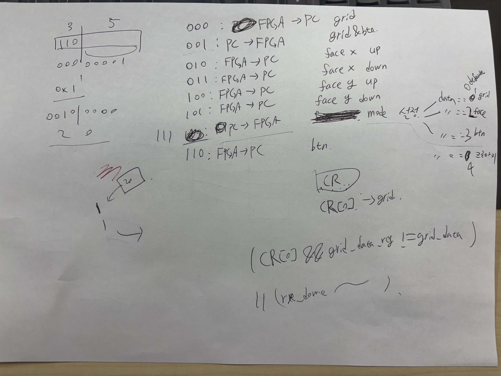

# ⚽ Ronaldo_Project  

## 📌 Git 사용법 (Push 방법)
- git add .
- git commit -m "업데이트 할 내용 요약"
- git push

### 😄 이모티콘 모음
🚀 [Tips](./Software/markdown.md)

### ⚠️ 주의사항
- 원본이 훼손되지 않도록 버전을 늘려가며 수정 후 Push
- 중요한 변경사항 발생 시 README.md → 필수 확인사항 섹션에 반드시 기록
- Pull하지 않은 상태(최신화 X) 인 상태로 Push 하면 오류 발생
- 따라서 매일 아침 Pull 하여 최신화 할 수 있도록
  
### ✅필수 확인사항
**코드 변경이나 확인 사항이 있다면 꼭 적기**

```
HW - UpScale 모듈 구현
   - 진동 센서 모듈 구현 
SW - Grid 생성을 H/W Uart에서 데이터를 받아 로직 변경 -> S/W 에서 8'd20을 보내면 보드에서 해당위치의 값을 보내줌(1,2,3,4,5) -> 해당값에 맞는 영역 표시만 SW에서 구현
 
```

```
dev11.py
- 게임 시작 버튼 없애고 키보드 입력으로 게임시작하도록 수정함
```

🚀 [TodaysUpdate](./TodaysUpdate)


### 🎯 해야 할 것

🚀 [TO DO](./ToDoList)

---

👥 역할 분담

찬하: Single Game 제작

은성: Multi Game 제작

유경: 게임 설명 (Info) 작성

현준: 화면 전환 시 모션 + 사운드 (버튼 시 siuuu~)
