# TEAM : 공공칠빵 ⚽ Ronaldo_Project  

```
⚠️ 주의 사항 : 항상 git pull 하고 git push

```


## 🚀프로젝트 개요


## 🙋‍♂️ 팀원

|**최윤석**|**윤종민**|**이현수**|**정현태**|
|:---:|:---:|:---:|:---:|
| [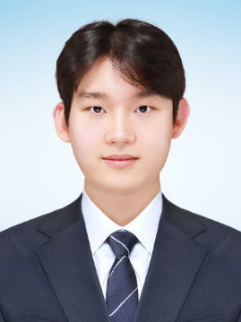 </br> @stockfail](https://www.notion.so/26b3062cbbcd80669198c099ce6f1c09) | [ </br> @yjm020500](https://github.com/yjm020500) | [ </br> @Hyunsoo-654](https://github.com/Hyunsoo-654) | [ </br> @hyeontae0327 ](https://github.com/hyeontae0327) |

|**엄찬하**|**송유경**|**이은성**|**양현준**|
|:---:|:---:|:---:|:---:|
| [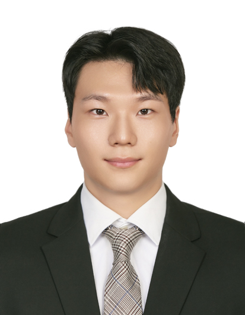 </br> @71105673](https://github.com/71105673/71105673) | [ </br> @SongYuGyeong](https://github.com/SongYuGyeong) | [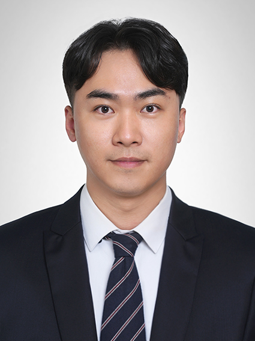 </br> @EunSeongL](https://github.com/EunSeongL) | [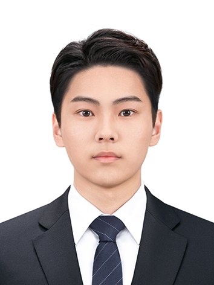 </br> @Hjune01](https://github.com/Hjune01) |

## 🖊️ 역할

| 이름 | 역할 |
| :---: | :---: | 
| **Team Leader** <br>**최윤석** | SCCB Protocol 구현, AXI4_Lite 연결, Embedded 코딩 |
| **윤종민** | (RED,Grid Selection) Filter 설계 및 검증, UART 통신, AXI4_Lite 연결, Embedded 코딩 |
| **이현수** | (Sobel, Flesh) Filter 설계 및 검증 |
| **정현태** | (Sobel, Flesh) Filter 설계 및 검증 |
| **엄찬하** | Chromakey 설계 및 검증, VGA Sync 최적화, GUI 구현 |
| **송유경** | Chromakey 설계 및 검증, GUI 구현 |
| **이은성** | UART 통신 및 센서 설계, 시스템 통합 및 디버깅, GUI 구현 |
| **양현준** | UART 통신 및 센서 설계, 시스템 통합 및 디버깅, GUI 구현 |


## 🗓️ 개발 일정 <Gantt Chart>

|                     |  9/16  |  9/17  |  9/18  |  9/19  |  9/20  |  9/21  |  9/22  |  9/23  |  9/24  | 9/25  |
| :-----------------:| :---: | :---: | :---: | :---: | :---: | :---: | :---: | :---: | :---: | :---: |
| 주제 선정             |   O   |       |       |       |       |       |       |       |       |       |
| 역할 분담             |   O   |       |       |       |       |       |       |       |       |       |
| SCCB 설계            |   O   |   O   |   O   |   O   |       |       |       |       |       |       |
| Image Filter 설계    |   O   |   O   |       |       |       |   O   |       |       |       |       |
| Image Filter 검증    |   O   |   O   |   O   |       |       |   O   |       |       |       |       |
| Python UI 제작       |   O   |   O   |   O   |   O   |   O   |   O   |   O   |   O   |   O   |   O   |
| UART, Sensor 설계    |       |       |       |   O   |   O   |       |       |       |       |       |
| SoC 설계             |       |       |       |       |       |   O   |   O   |   O   |       |       |
| 통합 및 디버깅         |       |       |       |       |   O   |   O   |   O   |   O   |   O   |   O   |
| 발표 자료 제작         |       |       |       |       |       |       |       |       |   O   |   O   |

## 💻 개발 환경

| TOOL | H/W | Language |
|:---:|:---:|:---:|
| 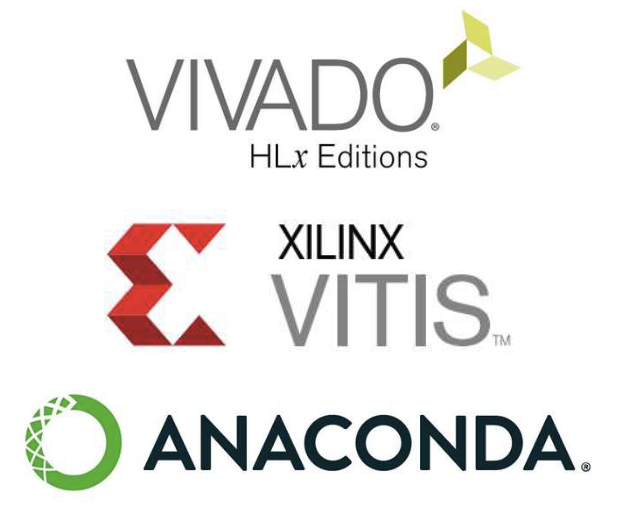 | 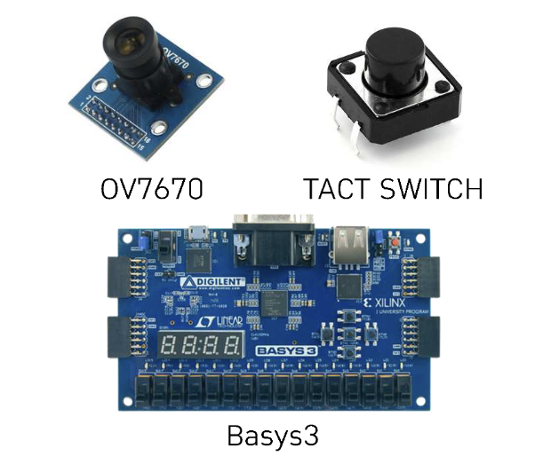 | 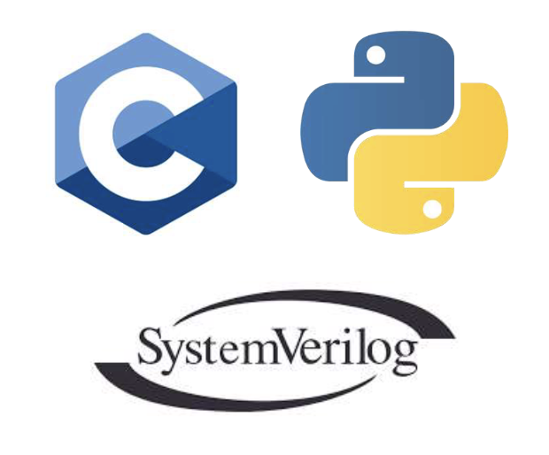|

## ⚙️ Software

### 🏗️ S/W Architecture

```
Software/
├── Ronaldo_Project.py  # 게임의 전체 흐름을 제어
├── Button.py           # 이미지/텍스트 버튼 클래스를 정의
├── Config.py           # 화면 크기, 색상, 폰트 등 게임 전반의 상수 및 설정값을 정의
└── Photofunia.py       # GIF 프레임 추출 및 얼굴 이미지 합성을 처리
```
[🔗[Penalty Kick Game]](/Software/최종실행파일)<br>

---

### 🔍 Flow Chart

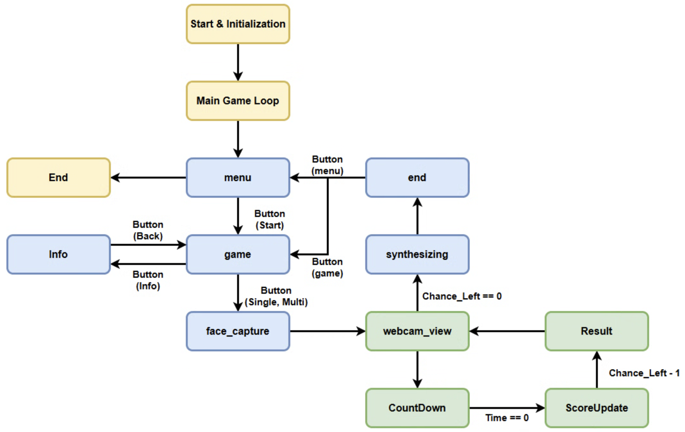 


>**(화면 및 메뉴) : 게임의 전반적인 시스템 흐름과 사용자 인터페이스**<br>
**(웹캠 및 게임 로직) : 웹캠을 이용한 실질적인 게임 플레이와 점수 계산 등 핵심적인 상호작용 처리**<br>
**(프로그램 흐름) : 프로그램의 시작, 실행, 완전한 종료까지 애플리케이션의 전체적인 주기 제어**<br>


[🔗[Game Guide]](/Software/README.md)<br>

---

## ⚙️ Hardware

### 🎨 FIlter Design & Verification

#### 📝 System Verilog Verification


#### 🎨 Sobel Filter Design & Verification

[🔗[Sobel Filter Design]](/Hardware/Design/Sobel_Filter_Design.md)<br>
[🔗[Sobel Filter Verification]](/Hardware/Verification/Sobel_Filter.md)<br>

#### 🎨 Flesh Filter Design & Verification

[🔗[Flesh Filter Design]](/Hardware/Design/Flesh_Filter_SystemVerilog_Design.md)<br>
[🔗[Flesh Filter Verification]](/Hardware/Verification/Flesh_Filter_SystemVerilog_Verification.md)<br>

#### 🎨 Red Globe_Grid Selection Design & Verification

[🔗[Red Glove Grid Select Design]](/Hardware/Design/Red_Glove_Grid_Select_Design.md)<br>
[🔗[Grid Select Verification]](/Hardware/Verification/Red_Glove_Grid_Select.md)<br>
[🔗[RedGlove Filter Verification]](/Hardware/Verification/Red_Glove_Filter.md)<br>

#### 🎨 ChromaKey Design & Verification

[🔗[Chromakey Design]](/Hardware/Design/Chromakey_Design.md)<br>
[🔗[Chromakey Verification]](/Hardware/Verification/Chromakey_Verification.md)<br>

#### 📸 OV7670
[🔗[OV7670 레지스터 정리]](/Hardware/OV7670.md)<br>

---

### 통신

#### UART

#### SCCB Design & Verification

---

### 🧑‍💻  SoC

| **SoC Structure** |
| :---: |
| 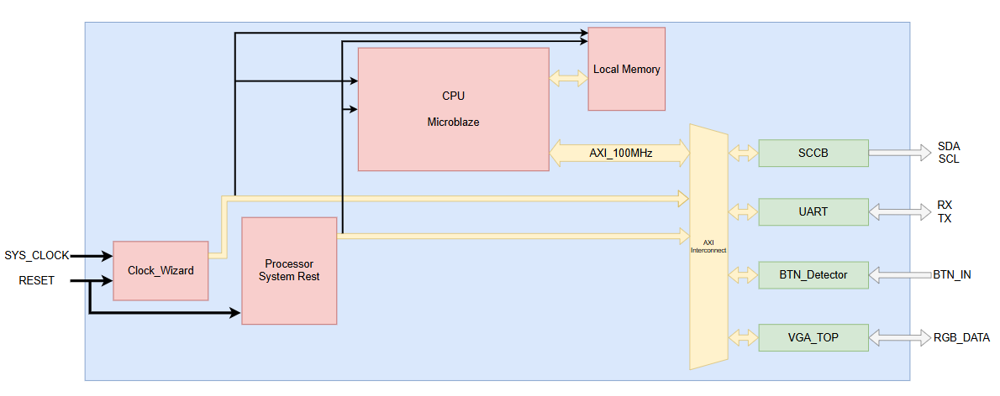|

<details>
    <summary>Memory Map</summary>
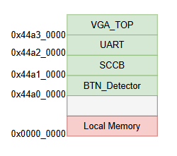
</details>

### 🧑‍💻  IP
> **AXI4-Lite 인터페이스를 기반으로 설계된 각 하드웨어 IP(BTN, UART, SCCB, VGA)**

<details>
    <summary> 🔖 BTN IP</summary>

| **AXI_BTN** |
| :---: |
| 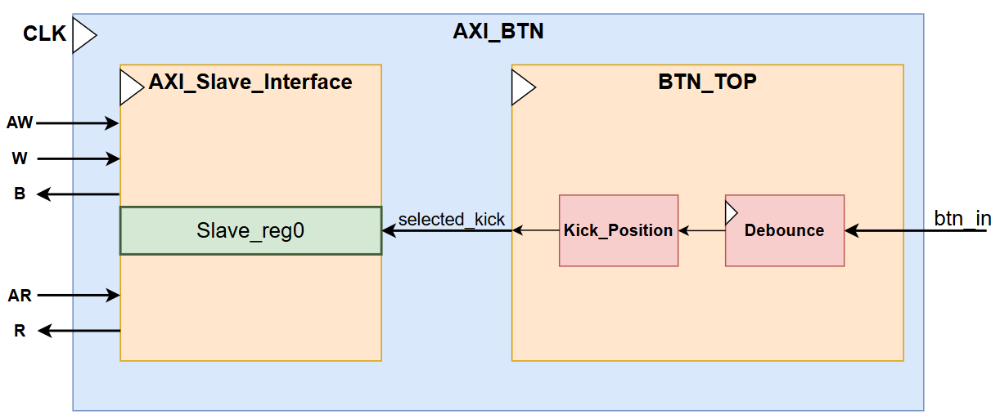 |
| **BTN_REG** |
| 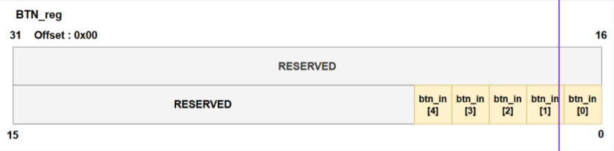 |

</details>

<details>
    <summary> 🔖 UART IP</summary>

| **AXI_UART** |
| :---: |
|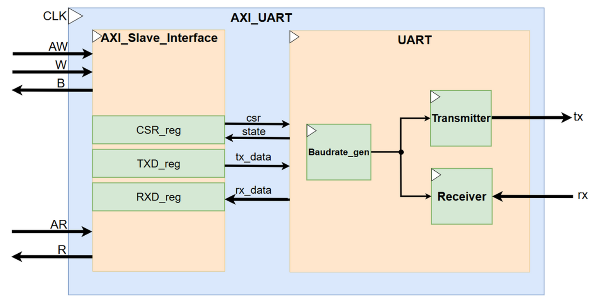|
| **UART_REG_CSR** |
|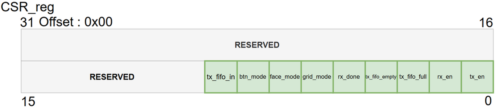|
| **UART_REG_RXD** |
|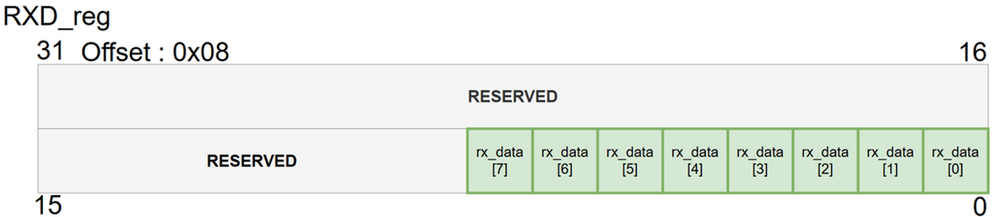|
| **UART_REG_TXD** |
|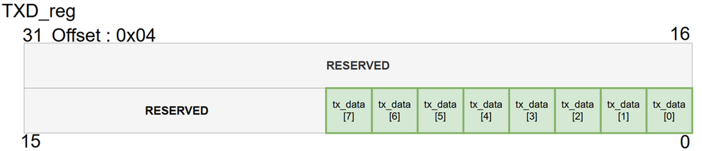|

</details>

<details>
    <summary> 🔖 SCCB IP</summary>

| **AXI_SCCB** |
| :---: |
| 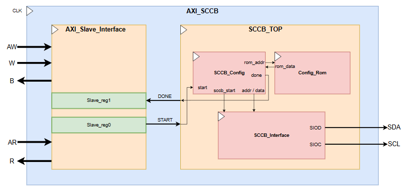 |
| **SCCB_REG_START** |
| 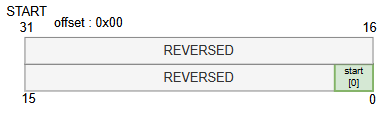 |
| **SCCB_REG_DONE** |
| 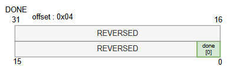 |

</details>

<details>
    <summary> 🔖 VGA IP</summary>

| **AXI_VGA** |
| :---: |
| 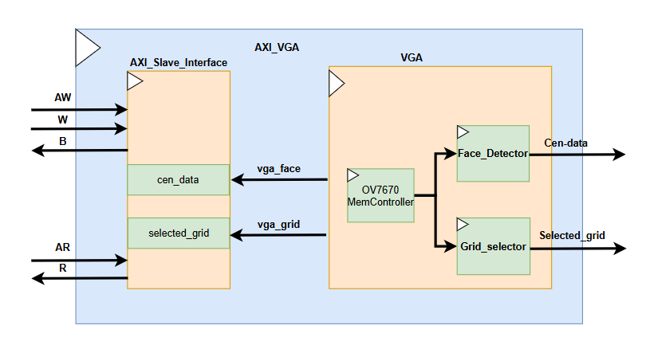 |
| **VGA_REG_Cen_Data** |
| 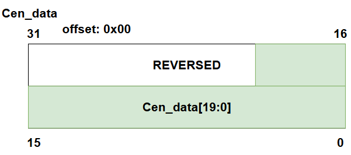 |
| **VGA_REG_Grid_Data** |
| 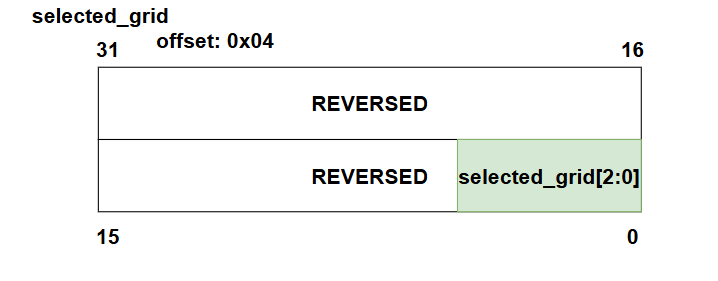 |

</details>

---

## ⚙️ Firmware

>**직접 설계한 AXI4-Lite 기반 IP (BTN, UART, SCCB, VGA)를 기반으로, 임베디드 시스템을 구현**

#### ⚙️ CODE [[Embedded]](/Firmware/main.c)<br>

---

## 🚀 Trouble Shooting
[🚀[Trouble Shooting1]](/TroubleShooting/TroubleShooting1.md)<br>
[🚀[Trouble Shooting2]](/TroubleShooting/TroubleShooting2.md)<br>
[🚀[Trouble Shooting3]](/TroubleShooting/TroubleShooting3.md)<br>
[🚀[Trouble Shooting4]](/TroubleShooting/TroubleShooting4.md)<br>


