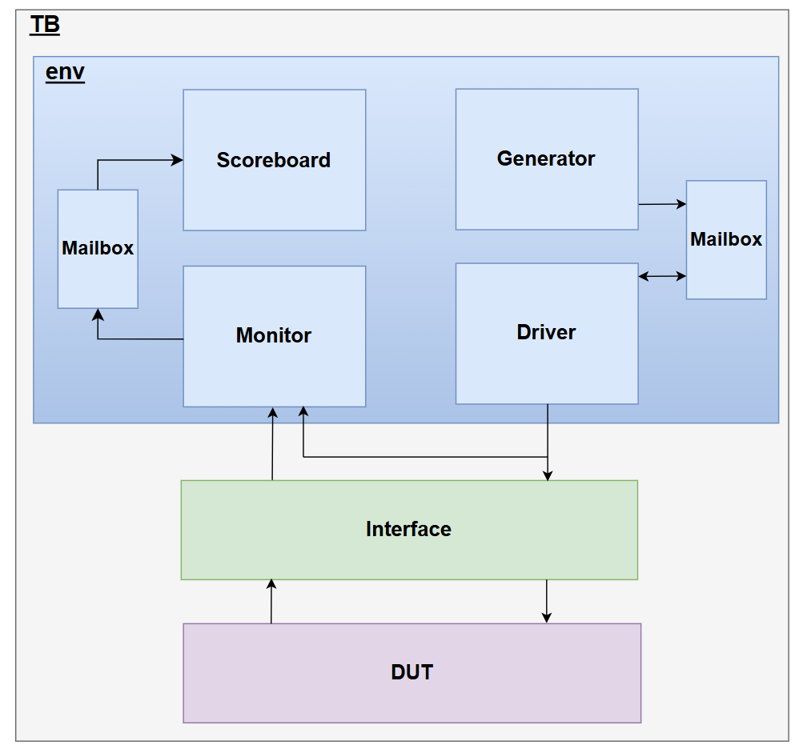
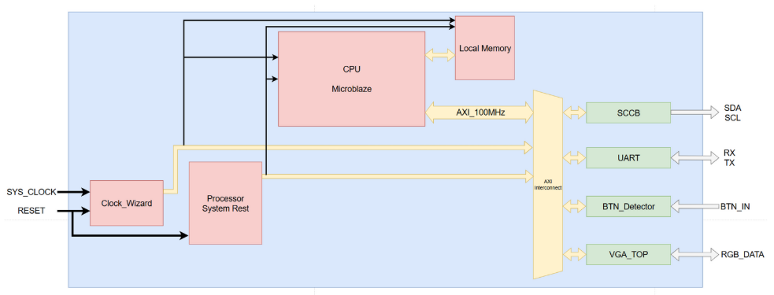
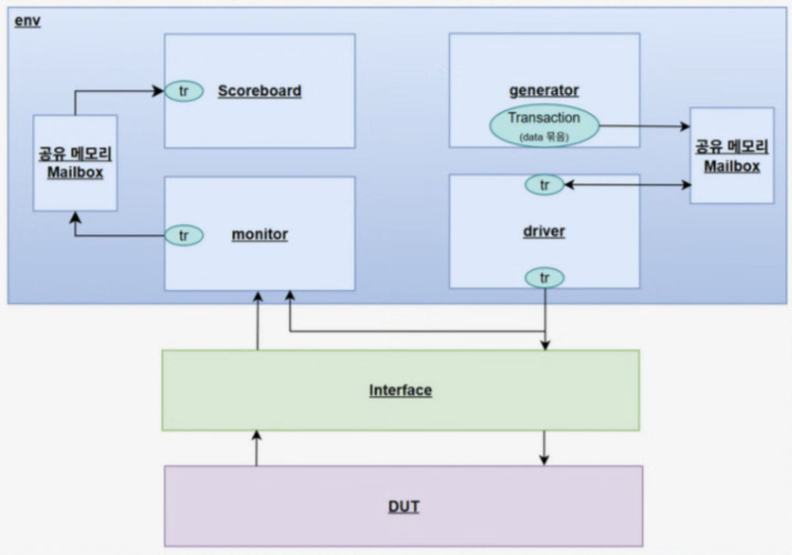

# TEAM : 공공칠빵 ⚽ Ronaldo_Project  

```
SoC, System verilog Verification 캡처 다시 화질이 안좋음

```


## 🚀프로젝트 개요


## 🙋‍♂️ 팀원

|**최윤석**|**윤종민**|**이현수**|**정현태**|
|:---:|:---:|:---:|:---:|
| [ </br> @stockfail](https://www.notion.so/26b3062cbbcd80669198c099ce6f1c09) | [ </br> @yjm020500](https://github.com/yjm020500) | [ </br> @Hyunsoo-654](https://github.com/Hyunsoo-654) | [ </br> @hyeontae0327 ](https://github.com/hyeontae0327) |

|**엄찬하**|**송유경**|**이은성**|**양현준**|
|:---:|:---:|:---:|:---:|
| [ </br> @71105673](https://github.com/71105673/71105673) | [ </br> @SongYuGyeong](https://github.com/SongYuGyeong) | [ </br> @EunSeongL](https://github.com/EunSeongL) | [ </br> @Hjune01](https://github.com/Hjune01) |

## 🖊️ 역할

| 이름 | 역할 |
| :---: | :---: | 
| **Team Leader** <br>**최윤석** | SCCB Protocol 구현, AXI4_Lite 연결, Embedded 코딩 |
| **윤종민** | (RED,Grid Selection) Filter 설계 및 검증, UART 통신, AXI4_Lite 연결, Embedded 코딩 |
| **이현수** | (Sobel, Flesh) Filter 설계 및 검증 |
| **정현태** | (Sobel, Flesh) Filter 설계 및 검증 |
| **엄찬하** | Chromakey 설계 및 검증, VGA Sync 최적화, GUI 구현 |
| **송유경** | Chromakey 설계 및 검증, GUI 구현 |
| **이은성** | UART 통신 및 센서 설계, 시스템 통합 및 디버깅, GUI 구현 |
| **양현준** | UART 통신 및 센서 설계, 시스템 통합 및 디버깅, GUI 구현 |


## 🗓️ 개발 일정 <Gantt Chart>

|                     |  9/16  |  9/17  |  9/18  |  9/19  |  9/20  |  9/21  |  9/22  |  9/23  |  9/24  | 9/25  |
| :-----------------:| :---: | :---: | :---: | :---: | :---: | :---: | :---: | :---: | :---: | :---: |
| 주제 선정             |   O   |       |       |       |       |       |       |       |       |       |
| 역할 분담             |   O   |       |       |       |       |       |       |       |       |       |
| SCCB 설계            |   O   |   O   |   O   |   O   |       |       |       |       |       |       |
| Image Filter 설계    |   O   |   O   |       |       |       |   O   |       |       |       |       |
| Image Filter 검증    |   O   |   O   |   O   |       |       |   O   |       |       |       |       |
| Python UI 제작       |   O   |   O   |   O   |   O   |   O   |   O   |   O   |   O   |   O   |   O   |
| UART, Sensor 설계    |       |       |       |   O   |   O   |       |       |       |       |       |
| SoC 설계             |       |       |       |       |       |   O   |   O   |   O   |       |       |
| 통합 및 디버깅         |       |       |       |       |   O   |   O   |   O   |   O   |   O   |   O   |
| 발표 자료 제작         |       |       |       |       |       |       |       |       |   O   |   O   |

## 💻 개발 환경

| TOOL | H/W | Language |
|:---:|:---:|:---:|
|  |  | |

## ⚙️ Software

### 🏗️ S/W Architecture

```
Software/
├── Ronaldo_Project.py  # 게임의 전체 흐름을 제어
├── Button.py           # 이미지/텍스트 버튼 클래스를 정의
├── Config.py           # 화면 크기, 색상, 폰트 등 게임 전반의 상수 및 설정값을 정의
└── Photofunia.py       # GIF 프레임 추출 및 얼굴 이미지 합성을 처리
```
[🔗[Penalty Kick Game]](/Software/최종실행파일)<br>

---

### 🔍 Flow Chart

 

```
(화면 및 메뉴) : 게임의 전반적인 시스템 흐름과 사용자 인터페이스
(웹캠 및 게임 로직) : 웹캠을 이용한 실질적인 게임 플레이와 점수 계산 등 핵심적인 상호작용 처리
(프로그램 흐름) : 프로그램의 시작, 실행, 완전한 종료까지 애플리케이션의 전체적인 주기 제어
```

[🔗[Game Guide]](/Software/README.md)<br>

---


### UART 


## ⚙️ Hardware

### Sobel Module
```
Sobel Module 관련 내용 작성
```

### Grid Selection
```
Grid Selection 관련 내용 작성
```

### Red Globe 
```
Red Globe 관련 내용 작성
```

### Chroma Key 
```
크로마키 관련 내용 작성
```

### SCCB
```
SCCB 관련 내용 작성
```

### Verification


```
Verification 관련 내용 작성
```

[🔗[OV7670 레지스터 정리]](/Hardware/OV7670.md)<br>

---

### Filter

### 통신
```
Uart, SCCB
```

### 🧑‍💻  SoC

| **SoC Structure** |
| :---: |
| |
| **Memory Map** |
| |

### 🧑‍💻  IP

| **IP** | **Register** |
| :---: | :---: |
| **BTN_Detector** | **BTN_REG** |

---

### 📝 System Verilog Verification

 


[🔗[Flesh Filter]](/Hardware/Verification/Flesh_Filter_SystemVerilog_Verification.md)<br>
[🔗[Chromakey]](/Hardware/Verification/Chromakey_Verification.md)<br>
[🔗[RedGlove Filter]](/Hardware/Verification/Red_Glove_Filter.md)<br>
[🔗[Grid Select]](/Hardware/Verification/Red_Glove_Grid_Select.md)<br>
[🔗[Sobel Filter]](/Hardware/Verification/Sobel_Filter.md)<br>

## 🚀 Trouble Shooting