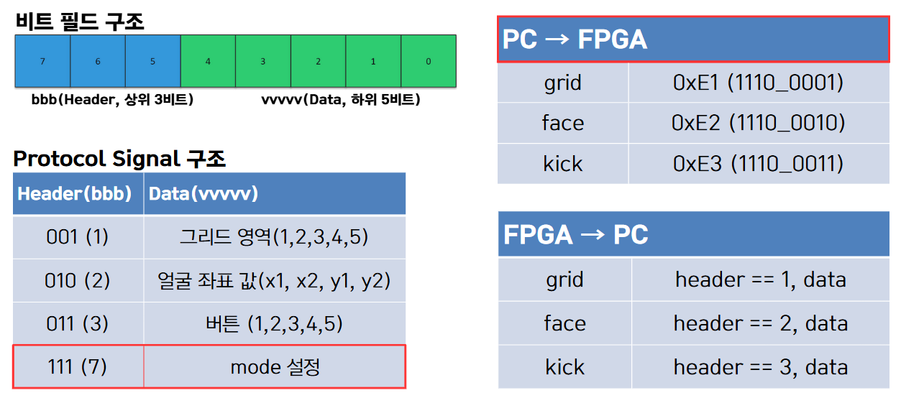

# UART 통신 & 프로토콜 (PK 시스템 PC-보드 연동)



## 1. 시스템 개요

**PC(Python/Pygame) ↔ 보드(Arduino/FPGA)** 간 UART 통신 구조와 **바이트 프로토콜**<br>
PC 애플리케이션은 Pygame 기반 게임 루프 안에서 **명령 송신**(grid/face/kick)과 **센싱 데이터 수신**(그리드 선택, 얼굴 좌표, 킥 선택)을 처리<br> 
송수신 규칙은 **1바이트 헤더(상위 3비트) + 5비트 페이로드**의 고정형 프레임으로 구성

---

## 2. 구조 및 구성 요소

1. **PC (Ronaldo_Project.py)**
   - Pygame 메인 루프 내에서 **시리얼 포트 오픈/읽기/쓰기**, **화면 상태 전환**, **UI 처리**를 수행
   - 두 개의 시리얼 포트 예시: 골키퍼(COM17), 공격수(COM13)

2. **Config 유틸 (Config.py)**
   - 화면/폰트/색상 정의 및 **보조 함수** 제공
   - 특히 `send_uart_command()`가 **명령 → 1바이트 코드**로 매핑하여 보드로 송신

3. **보드 측 펌웨어(별도)**
   - PC 명령을 수신하여 **해당 센싱 데이터**를 적절한 헤더와 5비트 페이로드로 **즉시/주기적 송신**
   - 예: 얼굴 좌표(20비트)는 **5비트 × 4청크**로 나누어 순차 전송

---

## 3. 동작 원리

1. **명령 송신(PC→보드)**  
   PC는 현재 화면/라운드 상태에 따라 아래 명령을 전송
   - `grid` : 골키퍼의 **그리드 선택 요청**  
   - `face` : **얼굴 좌표 전송 모드 요청** (페이스 캡처 단계)  
   - `kick` : 공격수의 **킥 방향 요청** (2인 플레이)  
   전송은 `send_uart_command(ser, command)`로 수행. 내부 매핑은 
   `{'grid':225, 'face':226, 'kick':227}`

2. **데이터 수신(보드→PC)**  
   PC는 시리얼 버퍼를 읽고, **상위 3비트(header=byte>>5)** 로 메시지 타입을 구분  
   - `001b(=1)` : **그리드 선택(1~5)**  
   - `010b(=2)` : **얼굴 좌표(20비트)**, 5비트씩 4바이트를 모아 `(x10b, y10b)`로 복원  
   - `011b(=3)` : **킥 방향(1~5)**

---

## 4. 통신 프로토콜 정의

### 4.1 명령 바이트(PC → 보드)

| 명령 | 의미 | 전송 바이트(10진) | 비트 패턴(상위3/하위5) |
|---|---|---:|---|
| `grid` | 골키퍼 그리드 선택 요청 | 225 | `111 00001` |
| `face` | 얼굴 좌표 송신 모드 요청 | 226 | `111 00010` |
| `kick` | 공격수 킥 방향 요청 | 227 | `111 00011` |

### 4.2 데이터 바이트(보드 → PC)

| 헤더(3b) | 타입 | 페이로드(5b) | 의미/해석 |
|---|---|---|---|
| `001` (=1) | GRID | `1~5` | 선택된 **그리드 칸** |
| `010` (=2) | FACE | 4바이트 연속 (각 5b) | 총 20비트: `x=10b, y=10b` |
| `011` (=3) | KICK | `1~5` | 공격수 **킥 방향** |


---

## 5. 처리 흐름(예시)

1. **페이스 캡처 화면 진입**  
   PC → 보드: `face(226)` 전송 → 보드가 `010` 헤더로 5비트×4 연속 송신 → PC `(x,y)` 복원

2. **카운트다운(5초)**  
   - PC → 보드: `grid(225)` / `kick(227)` 요청  
   - 보드 → PC: `001` / `011` 응답  
   - PC는 실시간으로 선택 강조 및 판정 처리

3. **결과/라운드 관리**  
   판정 후 GIF/사운드 연출 → 라운드 전환

---

## 6. CODE 예시

### 송신 매핑 (PC→보드)
```python
def send_uart_command(serial_port, command):
    commands = {'grid': 225, 'face': 226, 'kick': 227}
    byte_to_send = commands.get(command)
    if byte_to_send is not None and serial_port and serial_port.is_open:
        serial_port.write(bytes([byte_to_send]))
```

### 수신 파싱 (보드→PC)
```python
uart_bytes = ser.read(ser.in_waiting)
for byte in uart_bytes:
    header = byte >> 5
    if header == 1:         # GRID
        value = byte & 31
    elif header == 3:       # KICK
        value = byte & 31
```

### FACE 좌표 수신/복원
```python
# 5비트 청크를 4개 모아 20비트로 결합
full = (chunks[0] << 15) | (chunks[1] << 10) | (chunks[2] << 5) | chunks[3]
x = (full >> 10) & 0x3FF   # 10b
y = full & 0x3FF           # 10b
```

---

## 7. 요약

- **프레임 형식**: `헤더(3b) + 페이로드(5b)`  
- **PC→보드**: grid=225, face=226, kick=227  
- **보드→PC**: GRID(001), FACE(010), KICK(011)
