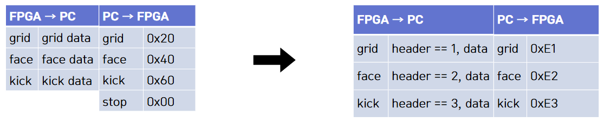

# UART 통신 & 프로토콜

## 1. 시스템 개요

- **PC(Python) ↔ FPGA** 간 UART **통신 구조**와 **프로토콜**<br>
   - PC 애플리케이션은 Pygame 기반 게임 루프 안에서 **명령 송신**(grid/face/kick)과 **센싱 데이터 수신**(그리드 선택, 얼굴 좌표, 킥 선택)을 처리<br> 
   - FGPA의 임베디드 SW는 PC로 **명령 수신**(grid/face/kick)과 **각 IP의 데이터**를 읽어 송신(그리드 선택, 얼굴 좌표, 킥 선택) 처리<br>
   - 송수신 규칙은 **1바이트 헤더(상위 3비트) + 데이터(하위 5비트)**의 고정형 프레임으로 구성
        


---

## 2. 구조 및 구성 요소

1. **PC (Ronaldo_Project.py)**
   - Pygame 메인 루프 내에서 **시리얼 포트 오픈/읽기/쓰기**, **화면 상태 전환**, **UI 처리**를 수행
   - 두 개의 시리얼 포트 예시: 골키퍼(COM17), 공격수(COM13)

2. **Config (Config.py)**
   - 화면/폰트/색상 정의 및 **보조 함수**
   - 특히 `send_uart_command()`가 **명령 → 1바이트**로 매핑하여 보드로 송신

3. **보드 측 펌웨어(별도)**
   - PC 명령을 수신하여 **해당 센싱 데이터**를 헤더와 데이터로 **즉시/주기적 송신**
   - 예: 얼굴 좌표(20비트)는 **5비트 × 4청크**로 나누어 순차 전송

---

## 3. 동작 원리

1. **명령 송신(PC→FPGA)**  
   PC는 현재 화면/라운드 상태에 따라 아래 명령을 전송
   - `grid` : 골키퍼의 **그리드 선택 요청**  
   - `face` : **얼굴 좌표 전송 모드 요청** (페이스 캡처 단계)  
   - `kick` : 공격수의 **킥 방향 요청** (2인 플레이)  
   전송은 `send_uart_command(ser, command)`로 수행. 내부 매핑은 
   `{'grid':225, 'face':226, 'kick':227}`

2. **데이터 수신(FPGA→PC)**  
   PC는 시리얼 버퍼를 읽고, **상위 3비트(header=byte>>5)** 로 메시지 타입을 구분  
   - `001b(=1)` : **그리드 선택(1~5)**  
   - `010b(=2)` : **얼굴 좌표(20비트)**, 5비트씩 4바이트를 모아 `(x10b, y10b)`로 복원  
   - `011b(=3)` : **킥 방향(1~5)**

---

## 4. 통신 프로토콜 정의

### 4.1 명령 바이트(PC → 보드)

| 명령 | 의미 | 전송 바이트(10진수) | 비트 패턴(상위3/하위5) |
|---|---|---:|---|
| `grid` | 골키퍼 그리드 선택 요청 | 225 | `111 00001` |
| `face` | 얼굴 좌표 송신 모드 요청 | 226 | `111 00010` |
| `kick` | 공격수 킥 방향 요청 | 227 | `111 00011` |

### 4.2 데이터 바이트(보드 → PC)

| 헤더(3b) | 타입 | 데이터(5b) | 의미/해석 |
|---|---|---|---|
| `001` (=1) | GRID | `1~5` | 선택된 **그리드 칸** |
| `010` (=2) | FACE | 4바이트 연속 (각 5b) | 총 20비트: `x=10b, y=10b` |
| `011` (=3) | KICK | `1~5` | 공격수 **킥 방향** |



---

## 5. 처리 흐름(예시)

1. **페이스 캡처 화면 진입**  
   PC → 보드: `face(226)` 전송 → 보드가 `010` 헤더로 5비트×4 연속 송신 → PC `(x,y)` 복원

2. **카운트다운(5초)**  
   - PC → 보드: `grid(225)` / `kick(227)` 요청  
   - 보드 → PC: `001` / `011` 응답  
   - PC는 실시간으로 선택 강조 및 판정 처리

3. **결과/라운드 관리**  
   판정 후 GIF/사운드 연출 → 라운드 전환

---

## 6. CODE 예시

### 송신 매핑 (PC→FPGA)
```python
def send_uart_command(serial_port, command):
    commands = {'grid': 225, 'face': 226, 'kick': 227}
    byte_to_send = commands.get(command)
    if byte_to_send is not None and serial_port and serial_port.is_open:
        serial_port.write(bytes([byte_to_send]))
```

### 수신 파싱 (FPGA→PC)
```python
uart_bytes = ser.read(ser.in_waiting)
for byte in uart_bytes:
    header = byte >> 5
    if header == 1:         # GRID
        value = byte & 31
    elif header == 3:       # KICK
        value = byte & 31
```

### FACE 좌표 수신/복원
```python
# 5비트 청크를 4개 모아 20비트로 결합
full = (chunks[0] << 15) | (chunks[1] << 10) | (chunks[2] << 5) | chunks[3]
x = (full >> 10) & 0x3FF   # 10b
y = full & 0x3FF           # 10b
```

### 임베디드 코드
```C
#include <stdio.h>
#include <stdint.h>
#include "sleep.h"
//#include "xparameters.h"

#define   Macro_Write_Block(dest, bits, data, pos)   ((dest) = (((unsigned)dest) & ~(((unsigned)bits)<<(pos))) | (((unsigned)data)<<(pos)))
#define Macro_Extract_Area(dest, bits, pos)      ((((unsigned)dest)>>(pos)) & (bits))

typedef struct {
    uint32_t START;
    uint32_t DONE;
} SCCB_TypeDef;

typedef struct {
    uint32_t cen_data;
    uint32_t selected_grid;
} VGA_TypeDef;

typedef struct {
   uint32_t CSR;
   uint32_t TXD;
   uint32_t RXD;
} UART_TypeDef;

typedef struct {
   uint32_t selected_kick;
} BTN_TypeDef;

#define AXI_BASE    0x44A00000

#define SCCB_BASE   0x44A10000
#define UART_BASE   0x44A20000
#define VGA_BASE    0x44A30000
#define BTN_BASE    0x44A00000


#define SCCB        ((SCCB_TypeDef *)SCCB_BASE)
#define UART      ((UART_TypeDef *)UART_BASE)
#define VGA         ((VGA_TypeDef  *)VGA_BASE)
#define BTN         ((BTN_TypeDef *)BTN_BASE)

#define MODE_GRID 0x1
#define MODE_FACE 0x2
#define MODE_BTN  0x3

void delay_ms(uint32_t ms);
void Update_VGA_Register_Value(VGA_TypeDef* vga, BTN_TypeDef* btn, uint32_t* vga_grid, uint32_t* vga_face, uint32_t* btn_in);
void UART_Init(UART_TypeDef * uart);
void UART_SendData(UART_TypeDef * uart, uint32_t data);
uint8_t UART_ReceiveDone(UART_TypeDef * uart);
uint32_t UART_ReceiveData(UART_TypeDef * uart);
uint8_t UART_IsChangeMode(uint32_t data);
void UART_SendModeChange(UART_TypeDef * uart, uint32_t data, uint8_t* mode);
void UART_SendValueData(UART_TypeDef * uart, uint32_t* vga_grid, uint32_t* vga_face, uint32_t* vga_btn, uint8_t mode);

uint32_t uart_data = 0;
uint8_t mode = MODE_GRID;

uint32_t vga_grid = 0;
uint32_t vga_face = 0;
uint32_t btn = 0;

int main()
{
      SCCB->START = 1;             // start
       delay_ms(1);     //
       SCCB->START = 0;             // tick

       UART_Init(UART);

   while(1)
   {
      Update_VGA_Register_Value(VGA, BTN, &vga_grid, &vga_face, &btn);

      if(UART_ReceiveDone(UART)) uart_data = UART_ReceiveData(UART); // uart receive data

      if(UART_IsChangeMode(uart_data)) UART_SendModeChange(UART, uart_data, &mode); //if 0x7 -> change mode

      UART_SendValueData(UART, &vga_grid, &vga_face, &btn, mode); //send data


      usleep(100000);
   }

    return 0;
}

void delay_ms(uint32_t ms)
{
    volatile uint32_t count;
    for(uint32_t i = 0; i < ms; i++)
    {

        for(count = 0; count < 100000; count++);
    }
}

void Update_VGA_Register_Value(VGA_TypeDef* vga, BTN_TypeDef* btn, uint32_t* vga_grid, uint32_t* vga_face, uint32_t* btn_in)
{
   uint32_t temp_grid;
   uint32_t temp_face;
   uint32_t temp_btn;

   temp_grid = vga->selected_grid;
   temp_face = vga->cen_data;
   temp_btn = btn->selected_kick;

   uint32_t ori_face_data = temp_face&0x3ff;
   if(ori_face_data < 80) temp_face = temp_face&0xffc00;
   else temp_face = (temp_face&0xffc00) + (ori_face_data - 80);

   if( (*vga_grid) != temp_grid){
      *vga_grid = temp_grid;
   }

   if( (*vga_face) != temp_face){
      *vga_face = temp_face;
   }

   *btn_in = temp_btn;
}

void UART_Init(UART_TypeDef * uart)
{
   uart->CSR = 0x23; //grid
}

void UART_SendData(UART_TypeDef * uart, uint32_t data)
{
   uart->TXD = data;
}

uint8_t UART_ReceiveDone(UART_TypeDef * uart)
{
   if( (UART->CSR&(0x01<<4)) ) return 1;
   else return 0;
}

uint32_t UART_ReceiveData(UART_TypeDef * uart)
{
   return uart->RXD;
}

uint8_t UART_IsChangeMode(uint32_t data)
{
   if (Macro_Extract_Area(data, 0x7, 5) == 0x7) return 1;
   else return 0;
}

void UART_SendModeChange(UART_TypeDef * uart, uint32_t data, uint8_t* mode)
{
   switch(data&0x7){
      case MODE_GRID: Macro_Write_Block((uart->CSR), 0x7, 0x1, 5); *mode = MODE_GRID; break;
      case MODE_FACE: Macro_Write_Block((uart->CSR), 0x7, 0x2, 5); *mode = MODE_FACE; break;
      case MODE_BTN:  Macro_Write_Block((uart->CSR), 0x7, 0x4, 5);  *mode = MODE_BTN; break;
      default:   Macro_Write_Block((uart->CSR), 0x7, 0x0, 5);  *mode = 0; break;
   }
}

void UART_SendValueData(UART_TypeDef * uart, uint32_t* vga_grid, uint32_t* vga_face, uint32_t* vga_btn, uint8_t mode)
{
   uint32_t temp_data;

   switch(mode){
      case MODE_GRID: {
         while((uart->CSR & 0x1<<2));
         Macro_Write_Block(*vga_grid, 0x7, MODE_GRID, 5);
         UART_SendData(uart, *vga_grid);
         //uart->TXD = *vga_grid;
         break;
      }
      case MODE_FACE: {
          for (int i = 3; i >= 0; i--) {
              temp_data = (*vga_face >> (i*5)) & 0x1f;
              Macro_Write_Block(temp_data, 0x7, MODE_FACE, 5);

              while (uart->CSR & (0x1<<2));
              UART_SendData(uart, temp_data);
              //uart->TXD = temp_data;

              while (!(uart->CSR & (0x1<<3))); // 4) empty flag
          }
          break;
      }
      case MODE_BTN : {
         while((uart->CSR & 0x1<<2));
         Macro_Write_Block(*vga_btn, 0x7, MODE_BTN, 5);
         UART_SendData(uart, *vga_btn);
         break;
      }
   }
}


```

---

## 7. 요약

- **프레임 형식**: `헤더(3b) + 데이터(5b)`  
- **PC→FPGA**: grid=225, face=226, kick=227  
- **FPGA→PC**: GRID(001), FACE(010), KICK(011)
