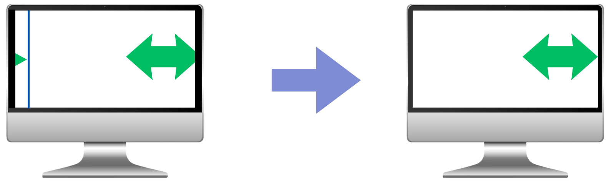
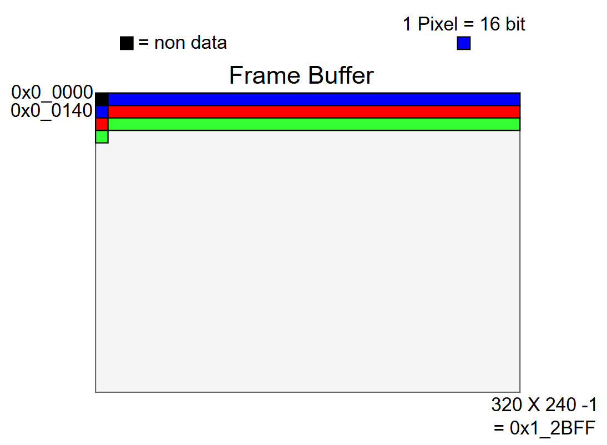

# 🎨 VGA Sync Timing Issue

## 📌 문제 상황
- 첫 번째 픽셀이 **0번지**가 아닌 **1번지**부터 들어가는 상황 발생  
- 픽셀은 0번지부터 읽기 때문에, **0번지 픽셀은 값이 없어 검정색 영역(Non-data)** 이 생김  
- 이로 인해 **X, Y 좌표의 Sync가 한 픽셀씩 밀려** VGA 영상이 깨지는 문제 발생  

---

## ✅ 문제 해결 방안

1. **클럭 안정화**
   - `negedge CLK` → `posedge CLK`으로 변환하여 안정적인 50% Duty-Cycle 클럭 생성  
   - `h_sync`, `v_sync`, `DE`를 **1 CLK 지연**(FF 삽입) → 타이밍 맞춤 및   
   - OV7670 Memory Controller에 **-1 주소 보정**을 통해 픽셀 밀림현상 해결  

2. **Metastability 방지**
   - **2중 FF 동기화** 적용  
   - OV7670 Memory Controller에 **-2 주소 보정** 적용  
